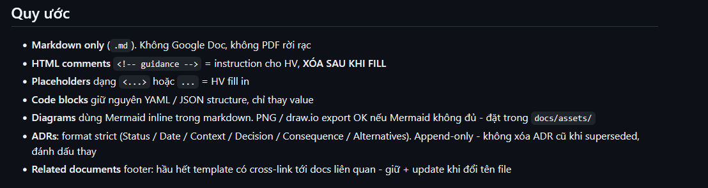
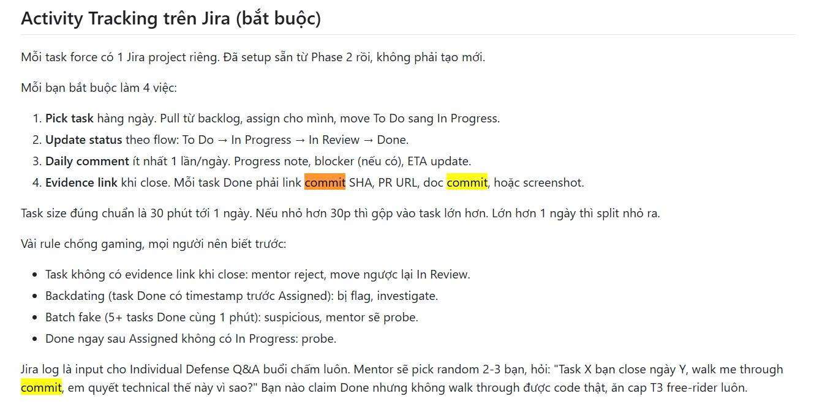
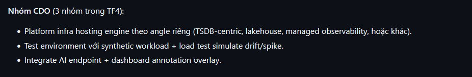

 **Client đang muốn xây dựng một "Hệ thống cảnh báo sớm thông minh" (Proactive Monitoring System) tên là Foresight Lens.**

Thay vì hệ thống gặp sự cố rồi mới đi sửa, họ muốn hệ thống phải **"biết trước, lo trước"**. Cụ thể, yêu cầu của họ được chia thành 3 ý lớn cực kỳ thực tế sau đây:

---

### 1. Hệ thống tự học và tự quan sát 24/7

* **Cách làm cũ:** Thường người ta phải ngồi cài đặt thủ công các ngưỡng cố định (ví dụ: CPU > 80% thì báo động). Cách này rất dở vì lúc cao điểm CPU 90% là bình thường, lúc thấp điểm CPU 40% có khi lại là bất thường.
* **Cái Client muốn:** Hệ thống phải tự nhìn vào các chỉ số (metrics) của từng dịch vụ liên tục. Nó phải **tự học để biết thế nào là "trạng thái bình thường" (baseline normal)** của từng dịch vụ theo thời gian mà không cần con người vào cấu hình bằng tay.

### 2. Cảnh báo trước khi sự cố xảy ra (Predictive)

* **Cách làm cũ:** Hệ thống đợi đến khi sập, nghẽn mạng, hoặc cạn kiệt tài nguyên rồi mới rú còi báo động (Reactive).
* **Cái Client muốn:** Hệ thống phải **chủ động bắn cảnh báo (ping) trước khi thảm họa xảy ra**. Ví dụ: Dựa trên tốc độ tăng trưởng dữ liệu hiện tại, hệ thống tính toán được khoảng vài tiếng nữa là bộ nhớ sẽ bị quá tải (capacity exhaustion) hoặc các chỉ số đang lệch dần so với quỹ đạo bình thường (drift), từ đó phát tín hiệu cảnh báo sớm.

### 3. Cảnh báo phải "có tâm" — Kèm theo giải pháp cụ thể

* **Cách làm cũ:** Hệ thống chỉ gửi một tin nhắn chung chung, vô tri như: *"Dịch vụ A đang bất thường!"* làm đội vận hành (DevOps/SRE) cuống cuồng đi tìm nguyên nhân.
* **Cái Client muốn:** Lời cảnh báo phải đi kèm một **đề xuất xử lý cụ thể, rõ ràng (Capacity Recommendation)**.
* *Ví dụ cụ thể:* "Dịch vụ A sắp hết bộ nhớ. Khuyến nghị: Hãy nâng cấp cơ sở dữ liệu RDS lên dòng cấu hình X, tăng số lượng xử lý đồng thời (worker concurrency) lên mức Y, và xóa bỏ hàng đợi Z vì không còn ai dùng."

---

### Một lưu ý cực kỳ quan trọng từ Client (Chốt chặn bảo mật):

Hệ thống này **CHỈ dừng lại ở việc Dự đoán + Gợi ý (Predict + Recommend)**, sau đó gửi cho con người duyệt.

Client **tuyệt đối không muốn hệ thống tự động nhảy vào sửa hay tự động tăng giảm cấu hình (No auto-remediation)**. Mọi hành động sửa chữa cuối cùng vẫn phải qua một nút duyệt thủ công của kỹ sư vận hành (Manual approval gate). Điều này giúp họ kiểm soát được chi phí hạ tầng và tránh các sai lầm dây chuyền do AI tự quyết định.

---

## Công nghệ CDO cần mapping

## 1. Giải thích các khái niệm kỹ thuật trong hình

Để hiểu dòng số 1, trước hết em cần nắm được các khái niệm và các loại "vũ khí" (công nghệ) đi kèm:

* **Platform Infra Hosting Engine:** Là việc dựng lên một hệ thống phần cứng/đám mây (ví dụ dùng máy chủ ảo AWS EC2 hoặc AWS ECS Fargate) để làm "nhà" cho bộ não AI chạy trên đó.
* **TSDB-centric (Trường phái lấy Database thời gian làm trung tâm):** * *Khái niệm:* **TSDB (Time-Series Database)** là loại cơ sở dữ liệu chuyên dụng để lưu các chỉ số thay đổi theo thời gian (như RAM, CPU tăng giảm từng giây).
* *Công nghệ/Agent đi kèm:* Thường dùng **Prometheus** (bản tự cài) hoặc **Amazon Timestream**. Agent đi kèm ở đây chính là **Node Exporter** (như bài lab em vừa làm) hoặc **CloudWatch Agent**. Nó liên tục đọc chỉ số máy chủ rồi đổ về TSDB.

* **Lakehouse (Trường phái Kho dữ liệu):**
* *Khái niệm:* Không dùng database xịn sò đắt tiền, người ta ném hết dữ liệu thô vào một cái "hồ chứa" giá rẻ.
* *Công nghệ/Agent đi kèm:* Lưu trữ bằng **Amazon S3**. Định dạng file lưu trữ siêu nén là **Parquet**. Khi cần đọc dữ liệu, họ dùng **AWS Glue** để gom và **Amazon Athena** để gõ lệnh SQL quét thẳng trên S3.

* **Managed Observability (Trường phái Giám sát tinh gọn):**
* *Khái niệm:* Giống TSDB nhưng nhóm không cần tự cài đặt hay quản lý database, AWS lo từ A-Z (gọi là *Managed*).
* *Công nghệ/Agent đi kèm:* Dùng **Amazon Managed Prometheus (AMP)** để lưu dữ liệu và **OpenTelemetry Collector (OTel Collector)** làm Agent thu thập chỉ số.

---

## 2. Giải thích dòng số 2 & 3 (Môi trường test và Giao diện)

* **Synthetic Workload & Load Test:** Trong môi trường thử nghiệm, không có người dùng thật truy cập để làm nghẽn máy. Vì vậy, nhóm CDO phải dùng các công cụ (như *JMeter, Locust, hoặc K6*) để **tự tạo ra lượng truy cập giả lập dữ dội** (*Synthetic workload*) nhằm ép CPU/RAM của hệ thống tăng vọt lên.
* **Simulate drift/spike:** Công cụ test phải giả lập được 4 kịch bản lỗi mà Client yêu cầu (lỗi tăng vọt đột ngột - *spike*, lỗi lệch dần dần - *drift*, lỗi rò rỉ bộ nghĩa - *leak*).
* **Integrate AI endpoint:** Kết nối đầu ra của bộ não AI với hệ thống giám sát. Khi AI tính toán xong, nó gửi kết quả qua một đường link kết nối (API Endpoint).
* **Dashboard annotation overlay:** Đây là giao diện hiển thị "có tâm" mà Client muốn trên Grafana. Bình thường Grafana chỉ vẽ một đường biểu đồ. Tính năng này cho phép **vẽ một cái nhãn/vạch ghi chú đè lên biểu đồ (overlay)**. Ví dụ: Tại đúng thời điểm đường biểu đồ RAM sắp vọt lên, Grafana sẽ hiện một vạch đỏ ghi chú rõ: *"AI dự đoán 15 phút nữa sập RDS, khuyến nghị nâng lên dòng class X"*.

---

## 3. Mối quan hệ và Cách chúng phối hợp giải quyết bài toán của Client

Mối quan hệ giữa các thành phần này là một **chuỗi dây chuyền khép kín**:

$$\text{Agent (Node Exporter/OTel)} \xrightarrow{\text{Thu thập}} \text{Hạ tầng (TSDB/S3/AMP)} \xrightarrow{\text{Cung cấp dữ liệu}} \text{Bộ não AI (Engine)}$$

Sau đó:

$$\text{AI Engine} \xrightarrow{\text{Dự đoán + Gợi ý}} \text{Grafana API} \xrightarrow{\text{Vẽ vạch ghi chú}} \text{Dashboard (Annotation Overlay)}$$

### Từng thành phần giải quyết vế nào trong yêu cầu của Client?

1. **Dòng 1 (Infra Angle):** Giải quyết bài toán **"Tự nhìn metrics 24/7 và Học baseline"**. Hạ tầng phải ngon thì AI mới có dữ liệu sạch để học tập liên tục mà không bị mất mát thông tin.
2. **Dòng 2 (Test Environment):** Giải quyết bài toán **"Chạy thật 4 kịch bản lỗi"**. Phải có môi trường giả lập lỗi này thì mới chứng minh được cho Client thấy là hệ thống AI hoạt động hiệu quả (đạt chỉ số bắt trúng lỗi $\ge 80\%$).
3. **Dòng 3 (Dashboard):** Giải quyết bài toán **"Cảnh báo kèm khuyến nghị cụ thể"**. Nhờ có nút găm ghi chú (*Annotation*) trên Grafana, đội vận hành nhìn vào biểu đồ là thấy ngay giải pháp AI khuyên (Scale RDS, tăng worker...) chứ không phải đọc một đống log chữ toàn mã code khô khan.

---

## 4. So sánh Ưu và Nhược điểm của 3 hướng đi (Angle) hạ tầng

Mỗi nhóm CDO trong dự án sẽ chọn 1 trong 3 cấu hình dưới đây để cạnh tranh giải pháp:

| Tiêu chí so sánh | Option A: Managed Observability | Option B: TSDB-centric (Streaming/Timestream) | Option C: Lakehouse (S3 + Athena) |
| --- | --- | --- | --- |
| **Bản chất** | Dùng đồ có sẵn của AWS lo từ A-Z. | Dùng database siêu tốc độ, dữ liệu chảy thời gian thực. | Gom dữ liệu thành file nén, vứt vào kho bãi giá rẻ. |
| **Ưu điểm** | • **Cực kỳ nhàn và ổn định:** Không sợ sập database. • Tích hợp với Grafana làm annotation mượt mà nhất. | • **Tốc độ đỉnh cao:** AI nhận dữ liệu ngay lập tức, độ trễ gần như bằng 0. • Thể hiện trình độ công nghệ cao. | • **Siêu rẻ:** Lưu trữ bao nhiêu dữ liệu lịch sử cũng không lo tốn tiền. • Không sợ cháy túi tiền $200 của Client. |
| **Nhược điểm** | • Chi phí ở mức trung bình khá. • Công nghệ quen thuộc, không có tính đột phá để khoe điểm. | • **Rất khó cấu hình:** Xử lý luồng dữ liệu streaming cực kỳ phức tạp, dễ lỗi code giữa chừng. | • **Độ trễ cao:** Do gom dữ liệu 5 phút một lần $\rightarrow$ **Rủi ro cao bị trễ thời gian báo trước 15 phút** của Client. |
| **Điểm số (Đánh giá)** | **An toàn nhất:** Phù hợp để làm sản phẩm chạy thật chắc chắn đúng deadline. | **Chất nhất:** Thích hợp để lấy điểm tuyệt đối từ Hội đồng nếu làm chủ được công nghệ. | **Kém nhất:** Chỉ nên dùng làm phương án phụ lưu trữ log lịch sử dài hạn (để Audit). |

