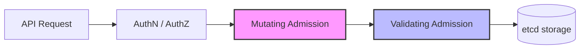

# 📖 Lý thuyết & Khái niệm cơ bản — Ngày 2 (D1)
*(Kubernetes RBAC & Admission Policy)*

> **Đường dẫn thư mục thực hành:** [cloud/w10/day-a/](file:///e:/Work/Developer/AWS/XBrain_devop_cloud/ThucHanh/vohongduc-aws-accelerator-p2/cloud/w10/day-a)
>
> Tài liệu này hệ thống hóa các định nghĩa, thuật ngữ và cơ chế hoạt động cốt lõi của **Kubernetes RBAC** và **Admission Policy** để làm tiền đề thực hành các bài Lab hardening cụm Kubernetes.

---

## 1. Kubernetes RBAC (Role-Based Access Control)

Phân quyền dựa trên vai trò (RBAC) là phương pháp quản lý quyền truy cập tài nguyên trong cluster dựa trên vai trò (role) của người dùng hoặc ứng dụng trong hệ thống.

### 🔑 Các thuật ngữ cốt lõi (Core Subjects & Resources)

*   **Subject (Đối tượng yêu cầu thực hiện hành động):**
    *   **User:** Người dùng thực tế (được định danh ngoài Kubernetes, e.g., quản lý qua AWS IAM, OpenID Connect, hoặc client certificates).
    *   **Group:** Tập hợp các User.
    *   **ServiceAccount:** Tài khoản dành riêng cho các tiến trình chạy trong Pod để tương tác bảo mật với Kubernetes API Server (e.g., Jenkins runner, Prometheus collector).
*   **Resource (Tài nguyên):** Các đối tượng Kubernetes như `pods`, `services`, `deployments`, `secrets`, `configmaps`.
*   **Verb (Hành động):** Các phương thức thao tác lên tài nguyên bao gồm `get`, `list`, `watch`, `create`, `update`, `patch`, `delete`.

### 🗂️ Các API Objects phân quyền

| Đối tượng | Phạm vi áp dụng (Scope) | Mô tả |
| :--- | :--- | :--- |
| **Role** | **Namespace-scoped** | Định nghĩa tập hợp các quyền (Resources + Verbs) trong giới hạn **một Namespace**. |
| **RoleBinding** | **Namespace-scoped** | Liên kết một `Role` (hoặc `ClusterRole`) tới các `Subjects` trong **một Namespace**. |
| **ClusterRole** | **Cluster-scoped** | Định nghĩa tập hợp quyền trên **toàn bộ Cluster** (áp dụng cho mọi namespace, tài nguyên cluster-wide như `Node`, `PV` hoặc các endpoint phi tài nguyên như `/healthz`). |
| **ClusterRoleBinding** | **Cluster-scoped** | Liên kết một `ClusterRole` tới các `Subjects` trên **toàn bộ Cluster**. |

> [!TIP]
> **Tối ưu hóa quản lý với ClusterRole:** Bạn có thể tạo một `ClusterRole` duy nhất (ví dụ: `view-only-secrets`) rồi liên kết nó bằng `RoleBinding` trong các namespace khác nhau. Điều này giúp gán quyền cụ thể theo từng namespace mà không cần phải nhân bản code `Role` sang từng nơi.

#### 📝 Ví dụ cấu hình Role & RoleBinding
```yaml
apiVersion: rbac.authorization.k8s.io/v1
kind: Role
metadata:
  namespace: development
  name: pod-reader
rules:
- apiGroups: [""] # "" đại diện cho core API group
  resources: ["pods"]
  verbs: ["get", "watch", "list"]
---
apiVersion: rbac.authorization.k8s.io/v1
kind: RoleBinding
metadata:
  name: read-pods
  namespace: development
subjects:
- kind: User
  name: "ducvh"
  apiGroup: rbac.authorization.k8s.io
roleRef:
  kind: Role
  name: pod-reader
  apiGroup: rbac.authorization.k8s.io
```

---

## 2. Kiểm tra quyền hạn với `kubectl auth can-i`

Đây là công cụ dòng lệnh (CLI) cực kỳ hữu ích giúp Quản trị viên/SRE debug nhanh và kiểm thử quyền truy cập mà không cần phải chuyển đổi cấu hình xác thực (kubeconfig).

*   **Kiểm tra quyền của chính mình:**
    ```bash
    kubectl auth can-i create pods
    ```
*   **Kiểm tra quyền của một User khác:**
    ```bash
    kubectl auth can-i create pods --as=ducvh
    ```
*   **Kiểm tra quyền của một ServiceAccount trong Namespace cụ thể:**
    ```bash
    kubectl auth can-i list secrets --as=system:serviceaccount:development:my-app-sa -n development
    ```
*   **Kiểm tra quyền thao tác trên một tài nguyên cụ thể:**
    ```bash
    kubectl auth can-i update deployment/my-deployment
    ```

---

## 3. Admission Controllers

**Admission Controllers** là các thành phần trung gian chặn (intercept) các yêu cầu gửi đến Kubernetes API Server **sau khi** yêu cầu đó đã đi qua bước Xác thực (Authentication) và Phân quyền (Authorization), nhưng **trước khi** đối tượng được lưu vào cơ sở dữ liệu `etcd`.

Quy trình xử lý của Admission Controller gồm 2 giai đoạn chính:



1.  **Mutating Admission (Thay đổi):** Có quyền can thiệp và **chỉnh sửa/bổ sung** thông tin của đối tượng trước khi được tạo/cập nhật (e.g., Tự động chèn sidecar container, bổ sung các nhãn mặc định).
2.  **Validating Admission (Xác thực):** Thực hiện **kiểm tra tính hợp lệ** của đối tượng và quyết định **chấp nhận (Allow)** hoặc **từ chối (Reject/Deny)** yêu cầu dựa trên luật định sẵn (e.g., Cấm deploy container chạy quyền root, bắt buộc phải có thông số tài nguyên limits/requests).

---

## 4. OPA (Open Policy Agent) & Gatekeeper

**OPA** là một Policy Engine mã nguồn mở và độc lập. **Gatekeeper** là một dự án tích hợp OPA trực tiếp vào Kubernetes dưới dạng một Admission Webhook thông qua các Kubernetes Custom Resources (CRDs).

### 📐 Khái niệm cấu trúc policy trong Gatekeeper

*   **Rego:** Ngôn ngữ khai báo (declarative query language) dùng để viết các luật kiểm tra logic. Rego nhận dữ liệu đầu vào (`input` chứa thông tin API Request) để đưa ra quyết định vi phạm.
*   **ConstraintTemplate:**
    *   Đóng vai trò như **Định nghĩa hàm (Function Definition)**.
    *   Chứa đoạn code logic viết bằng Rego và định nghĩa các tham số đầu vào (parameters) mà policy cần dùng.
*   **Constraint:**
    *   Đóng vai trò như **Lời gọi hàm (Function Call)**.
    *   Sử dụng cấu trúc được định nghĩa từ `ConstraintTemplate`, chọn lọc các đối tượng áp dụng (e.g., loại tài nguyên nào, namespace nào) và truyền giá trị cụ thể vào các tham số.

### 🛡️ Chế độ thực thi (Enforcement Actions)

*   **deny (hoặc enforce):** Chặn trực tiếp hành động không hợp lệ và phản hồi lỗi về phía client (e.g., `kubectl`).
*   **warn / audit:** Cho phép tạo tài nguyên nhưng ghi log cảnh báo vi phạm. Thích hợp khi deploy policy mới lên cluster đang hoạt động để đánh giá tác động trước khi áp dụng chặn thực tế.

---

## 5. ValidatingAdmissionPolicy (Native K8s 1.30+)

Đây là tính năng native của Kubernetes, cho phép quản trị viên khai báo các luật validating trực tiếp bằng cấu hình YAML thuần túy mà không cần deploy thêm Admission Webhook bên ngoài (như Gatekeeper/Kyverno). Điều này giúp giảm thiểu độ trễ mạng và tăng hiệu năng của API Server.

*   **CEL (Common Expression Language):** Ngôn ngữ biểu thức đơn giản, an toàn và hiệu năng cao được Kubernetes sử dụng để định nghĩa logic kiểm tra trực tiếp trong trường `expression` của `ValidatingAdmissionPolicy`.

#### 📝 Ví dụ cấu hình ValidatingAdmissionPolicy chặn replicas > 5
```yaml
apiVersion: admissionregistration.k8s.io/v1
kind: ValidatingAdmissionPolicy
metadata:
  name: "demo-limits-replicas"
spec:
  failurePolicy: Fail
  matchConstraints:
    resourceRules:
    - apiGroups:   ["apps"]
      apiVersions: ["v1"]
      operations:  ["CREATE", "UPDATE"]
      resources:   ["deployments"]
  validations:
    - expression: "object.spec.replicas <= 5"
      message: "Số lượng bản sao (replicas) không được vượt quá 5."
---
apiVersion: admissionregistration.k8s.io/v1
kind: ValidatingAdmissionPolicyBinding
metadata:
  name: "demo-limits-replicas-binding"
spec:
  policyName: "demo-limits-replicas"
  validationActions: [Deny]
  matchResources:
    namespaceSelector:
      matchLabels:
        environment: "dev"
```

---

## 6. Kyverno (Giải pháp thay thế)

**Kyverno** là một Policy Engine được thiết kế chuyên biệt cho Kubernetes. Khác với OPA/Gatekeeper sử dụng ngôn ngữ Rego tương đối phức tạp, Kyverno định nghĩa toàn bộ logic kiểm tra bằng cấu hình YAML quen thuộc.
*   Hỗ trợ đầy đủ các tính năng: Validation (xác thực), Mutation (thay đổi cấu hình), và Generation (tự động tạo tài nguyên đi kèm, ví dụ: tự động tạo NetworkPolicy mặc định khi có một Namespace mới được khởi tạo).
