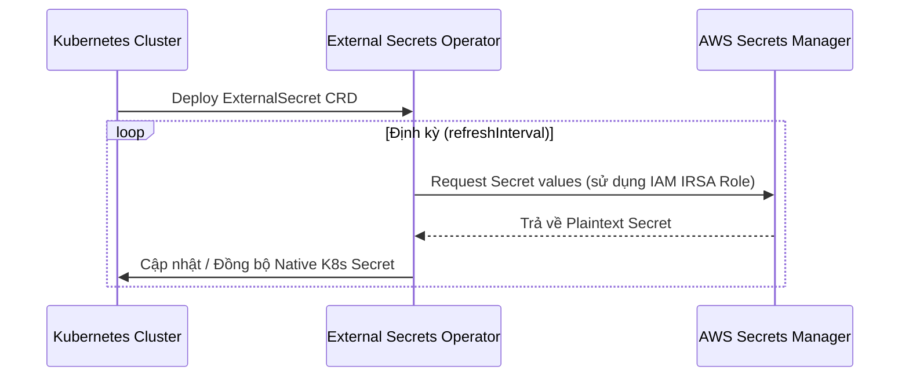
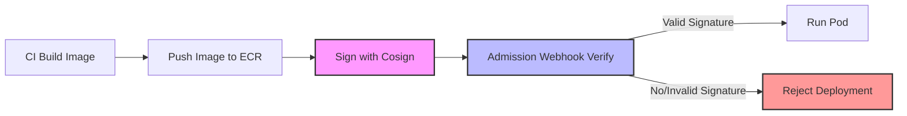

# 📖 Lý thuyết & Khái niệm cơ bản — Thứ 3 (D2)
*(Secrets Rotation & Supply Chain Security)*

> **Đường dẫn thư mục thực hành:** [cloud/w10/day-b/](file:///e:/Work/Developer/AWS/XBrain_devop_cloud/ThucHanh/vohongduc-aws-accelerator-p2/cloud/w10/day-b)
>
> Tài liệu này hệ thống hóa các định nghĩa, thuật ngữ và cơ chế bảo mật nâng cao liên quan đến **Secrets Management & Auto Rotation** và **Supply Chain Security** nhằm đảm bảo an toàn từ mã nguồn đến container image khi triển khai lên Kubernetes.

---

## 1. Secrets Management & Auto Rotation

Quản lý thông tin nhạy cảm (secrets) an toàn và tự động xoay vòng (rotation) là một trong những yêu cầu bắt buộc của các hệ thống Production hiện đại.

### 🔑 Các thành phần chính

*   **AWS Secrets Manager:**
    *   Dịch vụ quản lý bí mật được quản trị hoàn toàn bởi AWS.
    *   Hỗ trợ mã hóa secrets bằng AWS KMS (Key Management Service).
    *   Hỗ trợ **Auto Rotation (tự động xoay vòng)** thông qua AWS Lambda (ví dụ: tự đổi mật khẩu database định kỳ và cập nhật vào Secrets Manager).
*   **External Secrets Operator (ESO):**
    *   Một Kubernetes Operator đồng bộ hóa các secret từ các API bên ngoài (AWS Secrets Manager, HashiCorp Vault, v.v.) thành các đối tượng native `Secret` trong Kubernetes.
    *   Giúp tách biệt việc quản lý secrets ra khỏi chuỗi GitOps (không cần commit secret lên Git).
*   **Sealed Secrets (Bitnami):**
    *   Giải pháp mã hóa chiều đi (one-way encryption) cho phép dev mã hóa các K8s Secret thành `SealedSecret` dạng YAML an toàn.
    *   `SealedSecret` có thể commit lên Git công khai. Chỉ có controller chạy trong cụm K8s sở hữu private key mới giải mã được thành `Secret` thực tế.

---

### 🔄 Cơ chế hoạt động của External Secrets Operator (ESO)

ESO sử dụng cơ chế kéo (pull model) định kỳ để giữ cho Kubernetes Secrets luôn đồng bộ với AWS Secrets Manager.



#### 🗂️ Các API Objects trong ESO:
1.  **SecretStore (Namespace-scoped):** Định nghĩa cách kết nối và xác thực tới Provider (AWS Secrets Manager) trong một namespace cụ thể.
2.  **ClusterSecretStore (Cluster-scoped):** Tương tự như `SecretStore` nhưng áp dụng cho toàn bộ cluster, cho phép các namespace khác nhau dùng chung kết nối.
3.  **ExternalSecret:** Định nghĩa cụ thể secret nào cần lấy từ Provider, map vào K8s Secret nào, và tần suất đồng bộ (`refreshInterval`).

> [!IMPORTANT]
> **Rotate Secret < 60s No-Restart:**
> Bằng cách cấu hình `refreshInterval: 60s` (hoặc thấp hơn) trong `ExternalSecret`, K8s Secret sẽ tự động cập nhật giá trị mới khi AWS Secrets Manager xoay vòng mật khẩu.
> Tuy nhiên, Pod đang chạy sẽ **không tự động nhận** giá trị mới trừ khi:
> - Ứng dụng hỗ trợ reload secret động khi file mount thay đổi.
> - Sử dụng công cụ bổ trợ như **Reloader** (stakater) để tự động thực hiện Rolling Upgrade Pod khi K8s Secret thay đổi.

---

### 🔐 GitOps & Sealed Secrets

```mermaid
graph TD
    Plain[K8s Secret (Plaintext)] -->|kubeseal + Public Key| Sealed[SealedSecret YAML (Encrypted)]
    Sealed -->|Commit & Push| Git[Git Repository]
    Git -->|ArgoCD / GitOps| K8s[Kubernetes API Server]
    K8s -->|Sealed Secrets Controller + Private Key| RealSecret[Native K8s Secret]
    
    style Sealed fill:#f9f,stroke:#333,stroke-width:2px
    style RealSecret fill:#bbf,stroke:#333,stroke-width:2px
```

*   **Ưu điểm:** Hoàn toàn an toàn khi lưu trữ trên Git công khai, phù hợp với mô hình Declarative GitOps.
*   **Nhược điểm:** Phải quản lý public/private key thủ công trên cụm. Khi đổi cụm mới (fresh cluster) hoặc mất controller private key, bạn sẽ không giải mã được và phải mã hóa lại toàn bộ secret từ đầu.

---

## 2. Supply Chain Security (Bảo mật chuỗi cung ứng)

Bảo mật chuỗi cung ứng phần mềm tập trung vào việc bảo vệ mã nguồn, các thư viện phụ thuộc (dependencies), build pipeline và container images trước khi chúng được đưa lên môi trường chạy thực tế.

### 🔍 Trivy Image Scan
**Trivy** là một công cụ quét bảo mật toàn diện và dễ sử dụng để tìm ra các lỗ hổng (CVE - Common Vulnerabilities and Exposures), các cấu hình sai (misconfigurations), và rò rỉ dữ liệu nhạy cảm.
*   **Tích hợp CI/CD:** Trivy quét image ngay sau khi build xong và trước khi push lên Registry.
*   **Fail-on Policy:** Cấu hình Trivy trả về lỗi (exit code khác 0, ví dụ `exit-code: 1`) khi phát hiện lỗ hổng ở mức độ nghiêm trọng xác định (`HIGH` hoặc `CRITICAL`). Hành động này sẽ dừng pipeline ngay lập tức để ngăn chặn image lỗi được đẩy lên registry.

```bash
# Quét lỗ hổng của ảnh và fail pipeline nếu phát hiện lỗi HIGH hoặc CRITICAL
trivy image --exit-code 1 --severity HIGH,CRITICAL my-app:latest
```

---

### 🖋️ Cosign / Sigstore (Ký số & Xác thực Image)

**Cosign** giúp ký số và xác thực container images (và các artifacts khác) một cách dễ dàng, giúp ngăn chặn cuộc tấn công Man-in-the-Middle hoặc giả mạo ảnh container.



*   **Key-based Signing:** Sử dụng cặp khóa công khai/bí mật (`cosign.key` và `cosign.pub`). Khóa bí mật được lưu trong GitHub Actions Secrets để ký ảnh, còn khóa công khai được cấu hình ở cụm K8s để xác thực.
*   **Keyless Signing (OIDC):** Không cần quản lý khóa tĩnh. Cosign tích hợp với các nhà cung cấp định danh (OIDC) như GitHub Actions để nhận một chứng chỉ tạm thời được ký bởi Fulcio (Certificate Authority của Sigstore) và ghi lại lịch sử ký vào Rekor (transparency log).

---

### 🛡️ Admission Webhook Verify Signature
Để đảm bảo toàn bộ các image chạy trong cụm K8s bắt buộc phải được ký bởi CI/CD đáng tin cậy của doanh nghiệp, chúng ta triển khai **Admission Policies** (thông qua Kyverno hoặc Gatekeeper):
*   Khi có yêu cầu Deploy Pod, Webhook sẽ kiểm tra thẻ chữ ký (`.sig`) đi kèm với image trên registry.
*   Nếu không tìm thấy chữ ký hợp lệ từ nguồn đáng tin cậy, Webhook sẽ **từ chối (Deny/Reject)** yêu cầu tạo Pod ngay tại cổng API Server.

---

### 📝 Exception Policy CVE (Exception ADR)
Trong thực tế, có những lúc hình ảnh chứa lỗ hổng CVE nhưng chưa thể khắc phục ngay do:
*   Chưa có bản vá (upstream patch) từ phía nhà phát triển thư viện.
*   Lỗ hổng không ảnh hưởng trực tiếp đến môi trường thực tế (false positive).

Lúc này, doanh nghiệp cần một quy trình phê duyệt ngoại lệ rõ ràng bằng văn bản:
1.  **Architecture Decision Record (ADR):** Tài liệu phân tích rủi ro, lý do bypass CVE, các biện pháp giảm thiểu thay thế, và thời hạn hết hạn của ngoại lệ (thường là 30 ngày).
2.  **Trivy Ignore (`.trivyignore`):** Ghi danh sách các mã CVE được phép bỏ qua để không làm fail CI/CD build.
3.  **Policy Exceptions:** Cấu hình miễn trừ tạm thời trong chính sách chặn của Kyverno/Gatekeeper đối với một số namespace hoặc image cụ thể.

---

## 3. Secrets Scanning (Quét rò rỉ mã nguồn)

Rò rỉ credentials (AWS Keys, Database passwords, API tokens) lên Git là một trong những nguyên nhân phổ biến nhất dẫn đến thảm họa bảo mật.

*   **Git Guardian / Trufflehog:**
    *   Các công cụ quét tĩnh tìm kiếm các chuỗi ký tự khớp với định dạng credential đã biết (regex-based và entropy-based).
    *   **Tích hợp Pre-commit Hooks:** Chặn không cho commit code nếu phát hiện có secret nằm trong code thay đổi ở local máy dev.
    *   **Tích hợp CI Pipeline:** Quét toàn bộ commits trong Pull Request. Nếu phát hiện rò rỉ, block merge và gửi cảnh báo tự động về kênh Slack/Teams bảo mật.

---

## 4. Tiêu chuẩn SLSA (Supply Chain Levels for Software Artifacts)

**SLSA (salsa)** là một bộ hướng dẫn và tiêu chuẩn bảo mật được Google và cộng đồng đề xuất nhằm cải thiện độ tin cậy của chuỗi cung ứng phần mềm.

| Cấp độ | Mục tiêu | Yêu cầu chính |
| :--- | :--- | :--- |
| **SLSA Level 1** | Tài liệu hóa quy trình xây dựng (Build Documentation) | Quy trình build phải tự động và tạo ra thông tin nguồn gốc (provenance metadata) mô tả cách artifact được tạo ra. |
| **SLSA Level 2** | Ngăn chặn giả mạo (Tamper Resistance) | Sử dụng một hosted build platform (như GitHub Actions). Thông tin nguồn gốc (provenance) phải được ký số bởi chính build platform. |
| **SLSA Level 3** | Khóa chặt hạ tầng Build (Hardened Build Platform) | Hạ tầng build phải cô lập hoàn toàn (isolated/hermetic), ngăn chặn việc tiêm mã độc vào quá trình biên dịch từ bên ngoài. |
