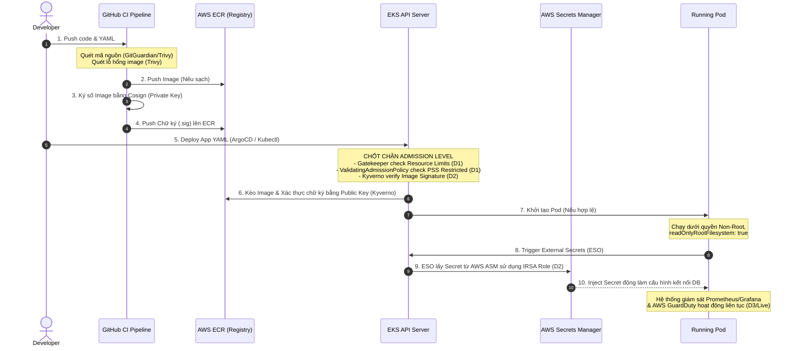

# 🔗 Mối liên hệ & Sự kết nối giữa các Day (D1, D2, D3) phục vụ cho Lab Thực chiến (Thứ 5 & Thứ 6)
*(Hệ thống hóa Kiến thức tuần W10 - Hướng tới Xây dựng Nền tảng Cloud/DevOps Hoàn chỉnh)*

Tài liệu này phân tích mối quan hệ hữu cơ giữa các khối kiến thức tự học từ **Thứ 2 (D1)**, **Thứ 3 (D2)**, **Thứ 4 (D3)** và buổi học **Live Mentor**, chỉ ra cách các mảnh ghép này kết hợp lại với nhau để giải quyết bài Lab thực chiến lớn vào **Thứ 5 & Thứ 6** (Dọn dẹp cụm EKS bị tấn công với 6 rủi ro bảo mật chính và triển khai tự động chặn vi phạm ở cấp độ cluster level).

---

## 1. Tổng quan triết lý thiết kế tuần W10 (Secure & Operate)
Mục tiêu cốt lõi của tuần này không chỉ dừng lại ở việc bảo mật ứng dụng đơn lẻ, mà là xây dựng một **Hạ tầng tự động thực thi bảo mật ở cấp độ Cluster (Cluster-level Enforcement)**. 

Hệ thống sẽ hoạt động theo triết lý phòng thủ chiều sâu (Defense in Depth), đảm bảo rằng dù Developer có vô tình viết code không an toàn, hoặc cấu hình sai YAML, thì cluster vẫn có các chốt chặn tự động để phát hiện, ngăn cản hoặc cô lập lỗi đó ngay lập tức.

---

## 2. Mối quan hệ và sự kết nối giữa các Day (D1 ➡️ D2 ➡️ D3)

Sự kết nối giữa các ngày học được mô tả như một chuỗi cung ứng khép kín từ khâu Quản lý quyền lực, khâu Đóng gói/Vận chuyển, đến khâu Vận hành/Tích hợp nền tảng:

```
+------------------------------------+
|  Thứ 2 (D1): RBAC & ADMISSION     |  <-- Định nghĩa "Ai có quyền gì" & "Chỉ cho phép chạy những gì hợp lệ"
+------------------------------------+
                  |
                  v
+------------------------------------+
|  Thứ 3 (D2): SECRETS & SUPPLY      |  <-- Cung cấp Credential an toàn (ESO) & Xác thực tính toàn vẹn của Image (Cosign/Trivy)
+------------------------------------+
                  |
                  v
+------------------------------------+
|  Thứ 4 (D3): PLATFORM & SRE        |  <-- Liên kết toàn bộ stack (GitOps/Canary/Alert), ngân sách tài nguyên & Phục hồi sự cố
+------------------------------------+
```

### 🔹 Thứ 2 (D1) — RBAC & Admission Policy: Thiết lập luật chơi & Chốt chặn cổng vào
*   **Chốt chặn con người:** Sử dụng **RBAC** để phân quyền tối thiểu (least privilege). Tạo các Roles rõ ràng (`developer` chỉ làm việc trong namespace được giao, `viewer` chỉ được xem, `sre` có toàn quyền vận hành).
*   **Chốt chặn tài nguyên:** Sử dụng **OPA/Gatekeeper** và **ValidatingAdmissionPolicy** để làm chốt chặn ở cổng API Server. Bất kỳ file YAML nào được deploy (qua kubectl hay GitOps) nếu vi phạm chính sách bảo mật (ví dụ: đòi chạy root, thiếu Resource limit) sẽ bị API Server từ chối ngay lập tức.

### 🔹 Thứ 3 (D2) — Secrets Rotation & Supply Chain: Bảo vệ dữ liệu nhạy cảm & Xác minh nguồn gốc Image
*   **Bảo vệ bí mật:** Khi Pod được tạo thành công qua chốt chặn D1, nó cần kết nối tới Database. Thay vì nhúng credentials tĩnh vào code hay K8s Secret, chúng ta kết nối EKS với AWS Secrets Manager thông qua **ESO (External Secrets Operator)** và cơ chế **IRSA (IAM Roles for Service Accounts)**. Điều này giúp xoay vòng mật khẩu động mà không cần khởi động lại Pod.
*   **Bảo vệ chuỗi cung ứng:** Để ngăn tin tặc tiêm mã độc vào registry, toàn bộ container image phải đi qua pipeline CI có **Trivy Scan** (quét lỗ hổng) và được ký số bằng **Cosign** (chữ ký số). Admission Controller (Kyverno) ở cụm K8s sẽ đóng vai trò xác thực chữ ký: *Image không có chữ ký hợp lệ từ CI sẽ không thể khởi chạy*.

### 🔹 Thứ 4 (D3) — Platform Integration & SRE Operations: Giới hạn ngân sách, Giám sát chi phí & Ứng phó sự cố
*   **Giới hạn tài nguyên Namespace:** Sử dụng **ResourceQuota** và **LimitRange** để đảm bảo ứng dụng không chiếm dụng hết tài nguyên của cụm, ngăn ngừa hình thức tấn công từ chối dịch vụ (DoS/noisy neighbor).
*   **Tích hợp nền tảng (Platform Integration):** Gom tất cả các cấu hình từ D1, D2 cùng GitOps (ArgoCD), Observability (Prometheus/Grafana) thành một repo bootstrap nền tảng tự động triển khai.
*   **Ứng phó sự cố (Incident Response):** Sử dụng các kịch bản **Chaos Engineering** để thử nghiệm độ bền. Chuẩn bị tài liệu **Runbook/Playbook** để khi xảy ra tấn công, SRE có quy trình ứng phó 6 bước của AWS nhằm cô lập mạng (SG Swap/NetworkPolicy) và thu hồi tài nguyên bị thỏa hiệp trong thời gian ngắn nhất.

---

## 3. Sơ đồ luồng hoạt động tích hợp của Mini-Platform

Dưới đây là cách các cấu hình của Day A, B, C phối hợp hoạt động trong thực tế khi triển khai và chạy một ứng dụng:



---

## 4. Kết nối trực tiếp vào Bài Lab Thực Chiến "6-risk cluster cleanup + cluster-level enforcement" (Thứ 5 & Thứ 6)

Bài lab thực chiến yêu cầu bạn nhận bàn giao một cụm EKS đang bị compromise do tin tặc tấn công. Bạn phải đóng vai trò SRE/Security Engineer để thực hiện điều tra, dọn dẹp cụm (Clean up) và triển khai chính sách bảo mật tự động ở cluster level (Enforcement) để ngăn chặn cuộc tấn công tương tự.

Dưới đây là mối liên hệ trực tiếp giữa **6 Rủi ro bảo mật (6 risks)** trong bài Lab và các giải pháp đã học từ **D1, D2, D3**:

| Rủi ro bảo mật (Risks) | Mô tả chi tiết hành vi tấn công | Giải pháp khắc phục từ D1, D2, D3 |
| :--- | :--- | :--- |
| **Risk 1: Lộ Credentials tĩnh** | AWS Access Keys/Secrets bị hardcode trong Pod hoặc lưu ở Kubernetes Secrets tĩnh không được mã hóa. Tin tặc đọc được và chiếm quyền AWS Account. | **D2 / Live:** Loại bỏ hoàn toàn keys tĩnh. Thay thế bằng **IRSA (IAM Roles for Service Accounts)**. Kết hợp **AWS Secrets Manager** và **External Secrets Operator (ESO)** để đồng bộ credentials tự động với cơ chế xoay vòng mật khẩu dưới 60 giây. |
| **Risk 2: Chạy Pod đặc quyền cao (Privileged / Root)** | Pod cấu hình chạy dưới quyền root, hệ thống file cho ghi tự do. Tin tặc chiếm quyền Pod và ghi mã độc vào OS, thực hiện container escape tấn công sang Node vật lý. | **D1 / Live:** Triển khai chính sách **Pod Security Standards (PSS) Restricted** ở cấp Namespace. Enforce các giá trị `runAsNonRoot: true`, `readOnlyRootFilesystem: true`, và `allowPrivilegeEscalation: false` bằng **ValidatingAdmissionPolicy** hoặc **Gatekeeper**. |
| **Risk 3: Không giới hạn tài nguyên (No Resource Limits)** | Pod không khai báo RAM/CPU limits, hoặc Resource Quota. Tin tặc chạy script đào tiền ảo (crypto mining) làm nghẽn toàn bộ cụm, gây treo các app khác. | **D3:** Triển khai **ResourceQuota** giới hạn tài nguyên tối đa cho từng namespace, áp dụng **LimitRange** để tự động gán giá trị CPU/Memory request và limit mặc định cho mọi pod được tạo mới. |
| **Risk 4: Không cô lập mạng (Open Network Traffic)** | Các Pod trong cụm giao tiếp tự do không rào cản. Tin tặc chiếm quyền một Pod frontend và quét cổng, tấn công trực tiếp vào Pod DB nằm sâu bên trong. | **D2 / Live:** Thiết lập **NetworkPolicy** khóa chặt traffic mạng. Chỉ cho phép Pod backend nhận kết nối từ các Pod frontend đã được định nghĩa rõ ràng. Cấm tuyệt đối các traffic mạng lạ. |
| **Risk 5: Image chứa CVE & Không rõ nguồn gốc** | Cụm cho phép chạy bất kỳ image nào kéo từ Docker Hub công cộng, chứa hàng trăm lỗ hổng bảo mật nghiêm trọng. | **D2:** Cấu hình **Trivy Image Scan** trong CI pipeline để phát hiện sớm CVE. Thực thi chữ ký số **Cosign** và triển khai **Kyverno ClusterPolicy** chặn đứng việc deploy bất kỳ container image nào không được ký số hợp lệ. |
| **Risk 6: Thiếu quy trình ứng phó sự cố (Incident Response)** | Khi phát hiện Pod bị hack, SRE bối rối không biết làm gì, xóa pod lập tức làm mất dấu vết điều tra hoặc để tin tặc tiếp tục phá hoại qua kết nối mạng. | **D3 / Live:** Áp dụng **Quy trình ứng phó sự cố 6 bước của AWS**. Thực hiện **Label Swap (tháo nhãn)** để đưa Pod bị hack ra khỏi Service nhằm dừng traffic người dùng ngay lập tức, áp dụng **NetworkPolicy cô lập** để giữ nguyên Pod phục vụ điều tra forensics trước khi loại bỏ hoàn toàn (Eradicate). |

---

## 5. Hướng tới một Dự án Hoàn chỉnh (Production-grade DevOps Platform)

Để tạo ra được một project hoàn chỉnh, sẵn sàng ứng tuyển và làm nền tảng vững chắc cho bài tập lớn Capstone (W11-W12), ba ngày học này hội tụ thành một giải pháp thống nhất:

1.  **Hạ tầng an toàn (Hardened Infrastructure):** 
    *   Sử dụng Terraform để khởi tạo VPC cách ly, EKS cluster bật ghi log (Audit Logging) về CloudWatch.
    *   Phần quyền IAM Role cho Service Account (IRSA) để bảo vệ AWS layer.
2.  **Ứng dụng an toàn (Secure Pipeline):**
    *   Ứng dụng được quét mã độc tĩnh, quét thư viện phụ thuộc bằng Trivy và được ký chữ ký điện tử trong quy trình CI/CD.
3.  **Vận hành chuyên nghiệp (SRE & Guardrails):**
    *   Tự động đồng bộ ứng dụng và hạ tầng bằng GitOps (ArgoCD).
    *   Giám sát toàn diện telemetry (Prometheus, Grafana, AWS GuardDuty) để phát hiện bất thường ngay lập tức.
    *   Sẵn sàng các tài liệu Runbooks cho các sự cố phổ biến và hệ thống ngân sách tài nguyên (Quota/Limit) vững chãi.
