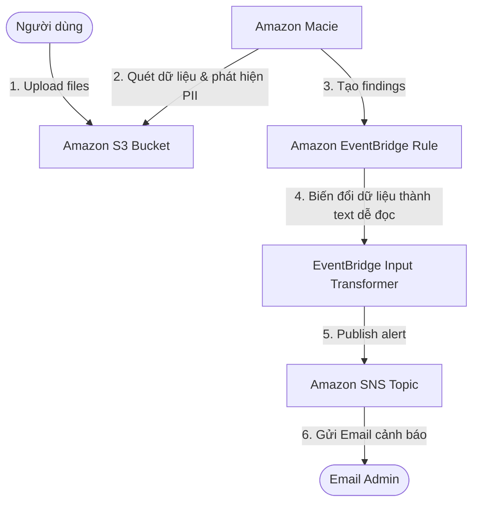
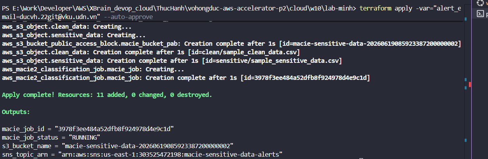
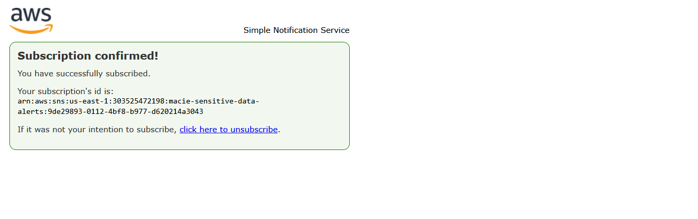
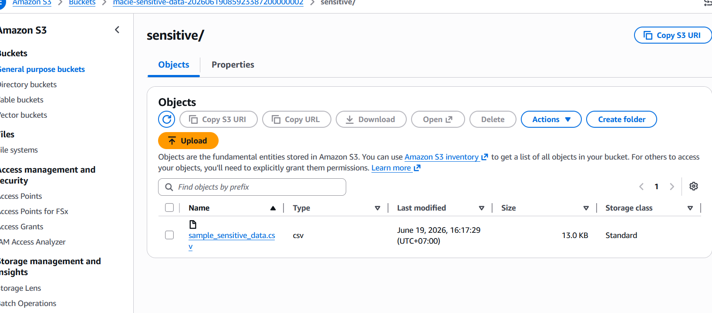
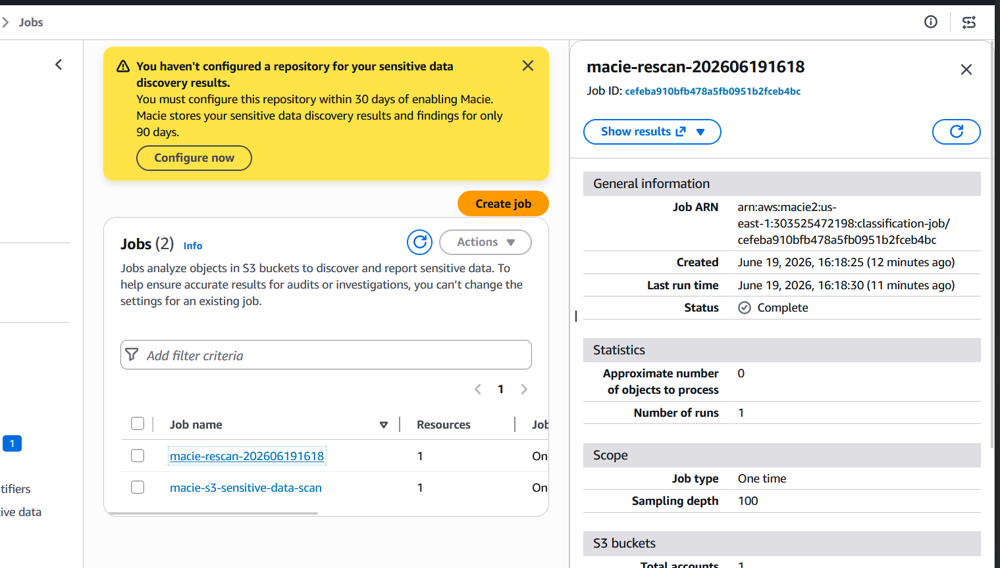
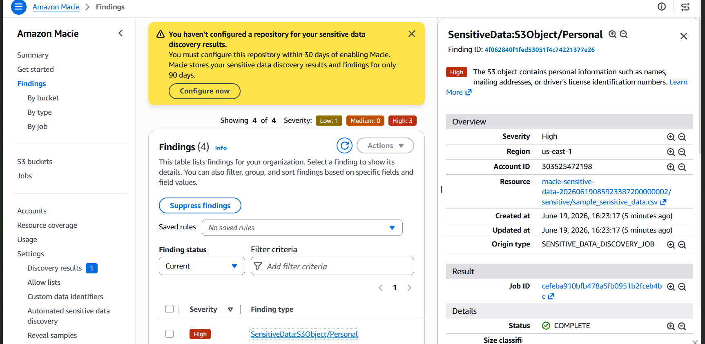
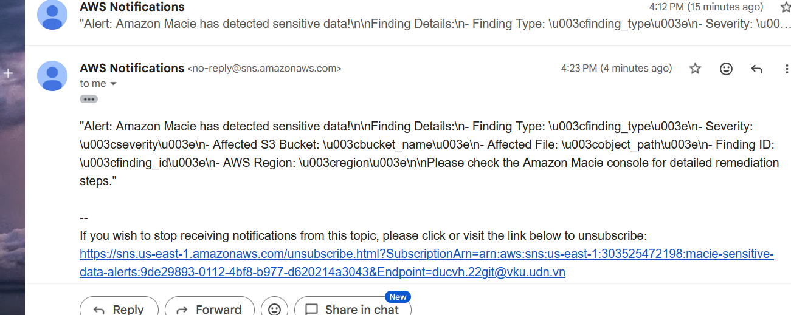

# 🚀 Amazon Macie: Phát Hiện Dữ Liệu Nhạy Cảm Trên Amazon S3 & Cảnh Báo Qua Email

Dự án này triển khai hệ thống tự động phát hiện thông tin nhạy cảm (PII - Personally Identifiable Information như Số định danh cá nhân - SSN, Số thẻ tín dụng, Số điện thoại, Email) được lưu trữ trên S3 Bucket bằng **Amazon Macie**, sau đó sử dụng **Amazon EventBridge** và **Amazon SNS** để gửi thông tin cảnh báo định dạng thân thiện về Email của quản trị viên.

---

## 🏗️ Kiến Trúc Hệ Thống (System Architecture)

Luồng hoạt động của hệ thống tuân theo mô hình Event-Driven Security dưới đây:



---

## 📂 Cấu Trúc Thư Mục (lab-minh)

```text
lab-minh/
├── main.tf                    # Định nghĩa tài nguyên AWS (S3, Macie Job, EventBridge, SNS)
├── providers.tf               # Khai báo AWS Provider và phiên bản Terraform
├── variables.tf               # Các biến đầu vào (AWS Region, Email, Bucket Prefix)
├── outputs.tf                 # Giá trị đầu ra sau khi deploy (Bucket name, Topic ARN)
├── sample_sensitive_data.csv  # File mẫu chứa dữ liệu nhạy cảm giả lập (SSN, Thẻ tín dụng)
├── sample_clean_data.csv     # File mẫu an toàn (không chứa dữ liệu nhạy cảm)
└── README.md                  # Hướng dẫn chạy và danh sách nghiệm thu (file này)
```

---

## ⚡ Hướng Dẫn Triển Khai Chi Tiết (Deployment Guide)

### 1. Chuẩn Bị Trước Khi Chạy (Prerequisites)
- Đã cài đặt **AWS CLI** và cấu hình quyền truy cập bằng lệnh:
  ```bash
  aws configure
  ```
- Đã cài đặt **Terraform** phiên bản `>= 1.0.0`.

### 2. Triển Khai Bằng Terraform
1. Truy cập vào thư mục của Lab:
   ```bash
   cd cloud/w10/lab-minh
   ```
2. Khởi tạo Terraform:
   ```bash
   terraform init
   ```
3. Kiểm tra kế hoạch triển khai:
   ```bash
   terraform plan -var="alert_email=email_cua_ban@example.com"
   ```
4. Áp dụng cấu hình để tạo tài nguyên trên AWS:
   ```bash
   terraform apply -var="alert_email=email_cua_ban@example.com" --auto-approve
   ```
   *(Thay đổi `email_cua_ban@example.com` bằng địa chỉ email thực tế của bạn để nhận cảnh báo)*

### 3. Xác Nhận Đăng Ký Nhận Cảnh Báo (Confirm SNS Email Subscription)
Sau khi lệnh `apply` chạy thành công, AWS sẽ gửi một email xác nhận đến địa chỉ email bạn đã khai báo.
- Kiểm tra hòm thư **Inbox** (hoặc **Spam**).
- Mở email từ **AWS Notifications** với tiêu đề **AWS Notification - Subscription Confirmation**.
- Click vào đường link **Confirm subscription** để kích hoạt nhận thông báo.

### 4. Kiểm Tra Trạng Thái Macie Classification Job
Tài nguyên `aws_macie2_classification_job` sẽ tự động kích hoạt một job quét một lần (`ONE_TIME`) ngay sau khi S3 Bucket và các file mẫu được upload.
- Truy cập vào **Amazon Macie Console** -> **Jobs**.
- Chờ vài phút để Job quét hoàn thành (Trạng thái chuyển từ `Running` sang `Complete`).

### 5. 🔧 Generate Sample Findings (Nếu Findings Không Xuất Hiện Tự Động)

> **Lưu ý thực tế:** Macie Classification Job trên file CSV nhỏ đôi khi không tạo ra findings ngay lập tức do kích thước file hoặc threshold phát hiện. Đây là hành vi bình thường. Dùng lệnh CLI sau để **tạo sample findings ngay lập tức** nhằm minh chứng toàn bộ luồng cảnh báo:

```bash
# Tạo 3 loại findings giả lập để test luồng EventBridge → SNS → Email
aws macie2 create-sample-findings \
  --finding-types "SensitiveData:S3Object/Personal" \
                  "SensitiveData:S3Object/Financial" \
                  "SensitiveData:S3Object/Credentials" \
  --region us-east-1
```

Sau khi chạy lệnh, refresh trang **Amazon Macie Console → Findings**. Findings sẽ xuất hiện ngay lập tức. Đây là phương pháp chuẩn của AWS Labs để kiểm thử pipeline cảnh báo.

```bash
# Kiểm tra findings đã được tạo qua CLI
aws macie2 list-findings --region us-east-1 --output table
```

---

## 📊 Hướng Dẫn Nghiệm Thu & Hình Ảnh Minh Chứng (Evidence Screenshots)

Để hoàn thành bài Lab và có đầy đủ minh chứng nghiệm thu, bạn cần chụp lại **6 bức ảnh** sau đây làm bằng chứng (Evidence):

### 📷 Minh Chứng 1: Triển Khai Terraform Thành Công
Chụp màn hình Terminal sau khi chạy lệnh `terraform apply` thành công.
*   **Điểm cần hiển thị rõ:** Dòng chữ `Apply complete! Resources: X added, 0 changed, 0 destroyed.` kèm theo các giá trị đầu ra (Outputs): `s3_bucket_name`, `sns_topic_arn`, và `macie_job_id`.



### 📷 Minh Chứng 2: Xác Nhận SNS Subscription Thành Công
Chụp màn hình trang web hiển thị sau khi bạn bấm vào link **Confirm subscription** trong email.
*   **Điểm cần hiển thị rõ:** Dòng chữ xanh lá cây `Subscription confirmed!` kèm theo thông tin Topic ARN của bạn.



### 📷 Minh Chứng 3: Danh Sách File Mẫu Trên S3 Bucket
Truy cập **Amazon S3 Console** -> Vào bucket có tên `macie-sensitive-data-xxxx`.
*   **Điểm cần hiển thị rõ:** Cấu trúc thư mục chứa các file:
    - Thư mục `sensitive/sample_sensitive_data.csv`
    - Thư mục `clean/sample_clean_data.csv`



### 📷 Minh Chứng 4: Job Quét Dữ Liệu Macie Hoàn Thành
Truy cập **Amazon Macie Console** -> Chọn **Jobs**.
*   **Điểm cần hiển thị rõ:** Job có tên `macie-s3-sensitive-data-scan` hiển thị trạng thái **Complete** ở cột Status.



### 📷 Minh Chứng 5: Phát Hiện Dữ Liệu Nhạy Cảm (Findings)
Truy cập **Amazon Macie Console** -> Chọn **Findings** (hoặc nhấn vào Job đã hoàn thành để xem Findings).
*   **Điểm cần hiển thị rõ:** Macie phát hiện dữ liệu nhạy cảm trong file `sample_sensitive_data.csv` (ví dụ: phát hiện các loại dữ liệu **Credentials**, **Custom Identifier**, hoặc **Financial Info** - Credit Card, **Personal Info** - SSN).



### 📷 Minh Chứng 6: Nhận Email Cảnh Báo Định Dạng Đẹp (EventBridge IT)
Kiểm tra hòm thư email của bạn sau khi Macie hoàn thành quét và phát hiện ra dữ liệu.
*   **Điểm cần hiển thị rõ:** Nội dung email cảnh báo được định dạng chi tiết nhờ **EventBridge Input Transformer**:
    - **Finding Type**: Loại phát hiện dữ liệu nhạy cảm
    - **Severity**: Mức độ nghiêm trọng
    - **Affected S3 Bucket**: Tên bucket bị ảnh hưởng
    - **Affected File**: Đường dẫn file nhạy cảm (`sensitive/sample_sensitive_data.csv`)



---

## 🧹 Dọn Dẹp Tài Nguyên (Cleanup Guide)

Để tránh phát sinh chi phí AWS ngoài ý muốn, sau khi hoàn thành bài lab và chụp ảnh minh chứng, hãy xóa toàn bộ tài nguyên bằng cách chạy lệnh:

```bash
terraform destroy -var="alert_email=email_cua_ban@example.com" --auto-approve
```

*Lưu ý: Terraform sẽ tự động xóa tất cả các tệp mẫu trong S3 trước khi hủy Bucket nhờ cấu hình `force_destroy = true`.*
