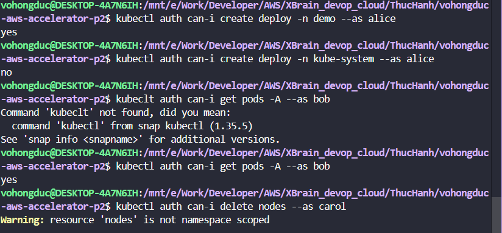
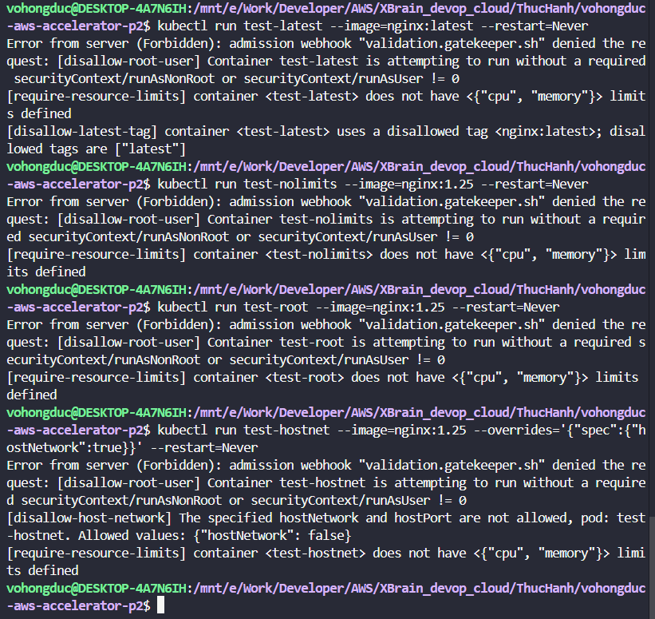
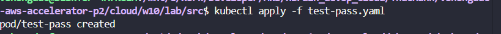
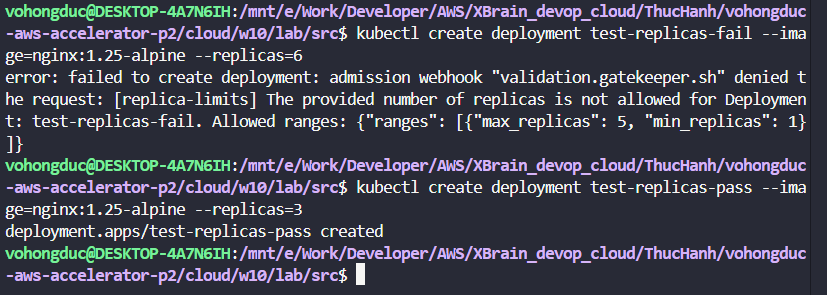
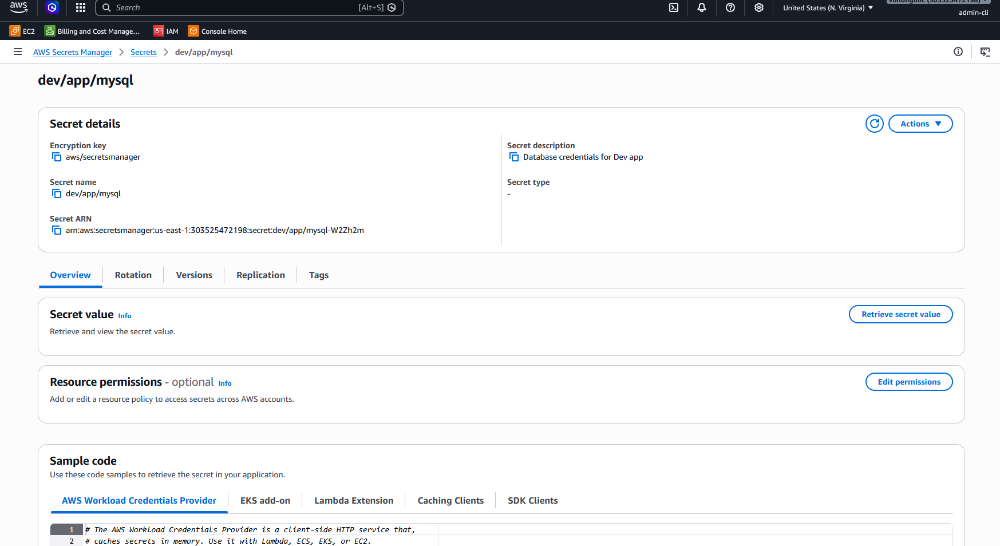
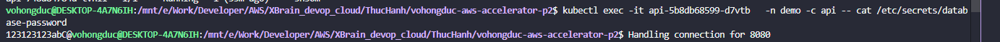
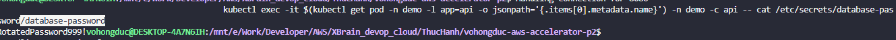
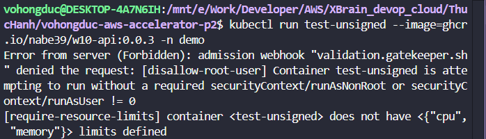
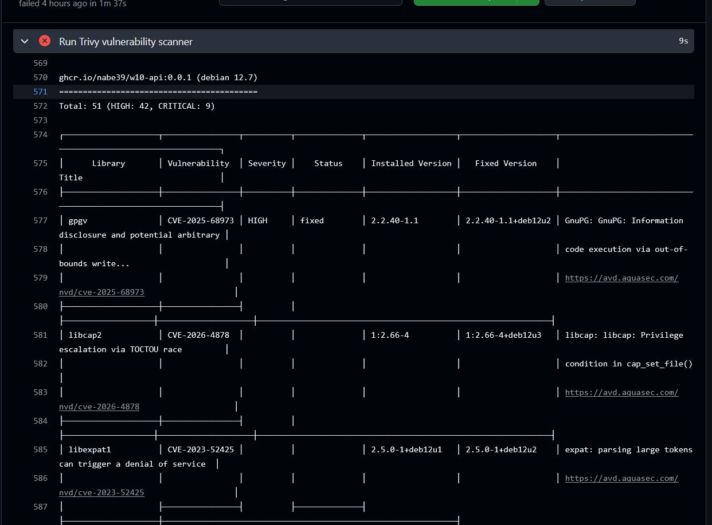
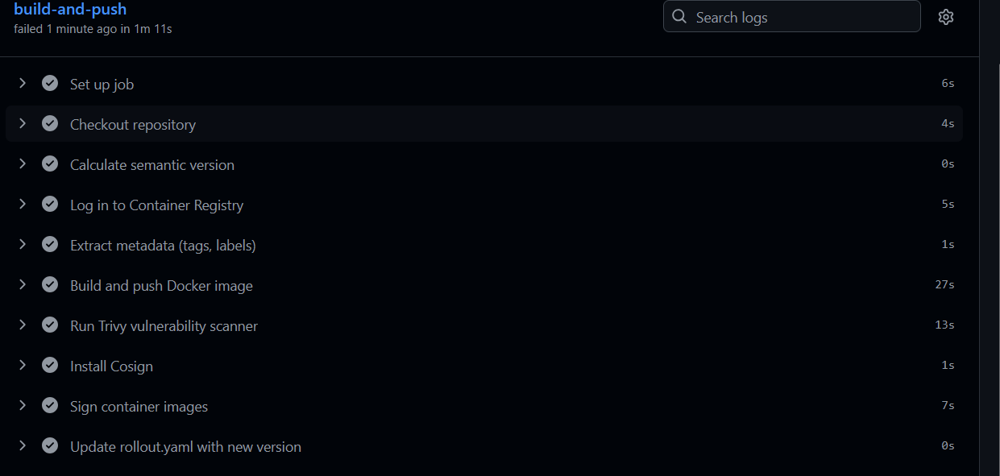

# 🚀 W10 - Secure & Operate: Progressive Delivery with Security Guardrails

Dự án này là hệ thống GitOps Mini-Platform hoàn chỉnh tích hợp giữa **Argo Rollouts (Progressive Delivery)**, **OPA Gatekeeper (Admission Control)**, **External Secrets Operator (Secrets Manager Sync)** và **Sigstore / Cosign (Supply Chain Security)**.

---

## 🏗️ Kiến trúc Hệ Thống
Hệ thống vận hành theo triết lý **Defense-in-depth** (Phòng thủ chiều sâu), bảo vệ ứng dụng ở cả 3 lớp:
1.  **Phân quyền (RBAC):** Ranh giới phân chia vai trò (Alice, Bob, Carol) qua mã khai báo GitOps.
2.  **Chốt chặn API Server (Admission Control):** OPA Gatekeeper chặn YAML lỗi; Sigstore verify chữ ký ảnh.
3.  **Bảo vệ Secrets:** Đồng bộ động từ AWS Secrets Manager qua ESO, cập nhật không restart Pod.

---

## 📂 Cấu Trúc Thư Mục Dự Án (Cập Nhật)

```
w10/lab/
├── rbac/                   # [MỚI] Khai báo Roles & RoleBindings phân quyền 3 nhóm người dùng
├── gatekeeper/             # [MỚI] Định nghĩa OPA Gatekeeper ConstraintTemplates & Constraints
├── eso/                    # [MỚI] Đồng bộ động credentials từ AWS Secrets Manager qua ESO
├── policies/               # [MỚI] Định nghĩa ClusterImagePolicy chứa public key của Cosign
├── signing/                # [MỚI] Lưu trữ khóa công khai cosign.pub phục vụ xác thực chữ ký
├── runbooks/               # [MỚI] Tài liệu hướng dẫn vận hành ESO, Cosign & Quy trình duyệt CVE
├── app-api/                # Ứng dụng API deployment cấu hình progressive canary rollout
├── app-analysis/           # Mẫu phân tích tự động thành công (Argo AnalysisTemplate)
├── app-alert/              # Cấu hình cảnh báo SLO qua Email
├── app-common/             # Namespace demo chứa các labels bảo mật bắt buộc
├── argocd/                 # GitOps Apps quản lý & đồng bộ tự động toàn cụm (App-of-Apps)
│   ├── apps/               # Danh sách các App cấu hình Wave
│   └── root.yaml           # App gốc đồng bộ toàn bộ mini-platform
└── README.md               # Tài liệu tổng quan (file này)
```

---

## ⚡ Hướng Dẫn Nhanh (Quick Start)

### 1. Khởi động cụm Minikube (Context w10)
```bash
minikube start -p w10 --driver=docker
kubectl config use-context w10
```

### 2. Cài đặt ArgoCD
```bash
kubectl create ns argocd
kubectl apply --server-side -n argocd \
  -f https://raw.githubusercontent.com/argoproj/argo-cd/stable/manifests/install.yaml
kubectl -n argocd rollout status deploy/argocd-server
```

### 3. Deploy Toàn Bộ Platform (App-of-Apps)
```bash
kubectl apply -f argocd/root.yaml
```

---

## 📊 Chi Tiết Thực Hành & Hình Ảnh Nghiệm Thu (Evidence)

---

### 🛡️ Lab 1.1: Phân Quyền Người Dùng (RBAC)
*   **Mô tả:** Thiết lập 3 vai trò: Developer (`alice`), SRE (`bob`), và Viewer (`carol`).
*   **Nghiệm thu:** Sử dụng Impersonation (`--as`) để giả lập quyền kiểm tra chốt chặn.
*   **Minh chứng thực tế:**
    

---

### 🛡️ Lab 1.2: OPA Gatekeeper (4 Chốt Chặn Admission)
*   **Mô tả:** Áp dụng các luật cấm deploy pod sử dụng tag `:latest`, cấm chạy quyền Root (`runAsUser: 0`), bắt buộc cấu hình Resource CPU/RAM Limits, và cấm chia sẻ cạc mạng Node (`hostNetwork: true`).
*   **Minh chứng thực tế:**
    *   *Minh chứng 1 (Deploy pod vi phạm bị chặn):*
        
    *   *Minh chứng 2 (Thông báo chi tiết lỗi chặn từ Gatekeeper Webhook):*
        

---

### 🛡️ Lab 1.3: Custom Policy (Replica Limits)
*   **Mô tả:** Tự viết ConstraintTemplate chứa logic Rego giới hạn số lượng bản sao Deployment chỉ được chạy từ 1 đến 5 Pod.
*   **Minh chứng thực tế:**
    

---

### 🔑 Lab 2.1: Đồng Bộ Secrets Động (External Secrets Operator)
*   **Mô tả:** Đồng bộ dynamic credential định kỳ 10 giây từ AWS Secrets Manager về Kubernetes Secret mà không chứa plaintext mật khẩu trên Git. Gắn volume mount để pod cập nhật mật khẩu mới tự động mà không restart Pod.
*   **Minh chứng thực tế:**
    *   *Minh chứng 1 (ESO tạo và đồng bộ hóa secret thành công):*
        
    *   *Minh chứng 2 (Sửa pass trên AWS CLI và kiểm tra mật khẩu giải mã trong cụm đã cập nhật):*
        
    *   *Minh chứng 3 (Pod nhận mật khẩu mới tự động từ file volume mount, AGE Pod giữ nguyên - không restart):*
        

---

### 🔑 Lab 2.2: Bảo Mật Chuỗi Cung Ứng (Trivy + Cosign + Sigstore)
*   **Mô tả:** Vá lỗi base image trong `Dockerfile`. Tích hợp Trivy quét lỗ hổng và Cosign ký số ảnh bằng Private Key trong CI pipeline. Cấu hình Sigstore Admission Controller đối chiếu chữ ký số bằng Public Key được nạp qua ClusterImagePolicy trong namespace `demo` (được kích hoạt nhãn).
*   **Minh chứng thực tế:**
    *   *Minh chứng 1 (Image không ký số hoặc ký sai khóa bị Admission chặn đứng):*
        
    *   *Minh chứng 2 (CI Pipeline quét Trivy sạch và tự động ký số bằng Cosign):*
        
    *   *Minh chứng 3 (Kiểm tra chữ ký số thủ công bằng lệnh Cosign Verify):*
        

---

## 📖 Tài Liệu Tham Khảo Thêm
Để tìm hiểu sâu hơn về mã nguồn chi tiết và lý thuyết vận hành, vui lòng tham khảo các tài liệu chuyên sâu sau:

1.  **[Hướng Dẫn Cấu Trúc File & Giải Thích Code](../docs/code-explain/README.md)**: Danh mục phân loại 24 file cấu hình.
2.  **[Chi Tiết Code & Logic Của Lab 1](../docs/code-explain/lab1_rbac_admission.md)**: Giải thích chi tiết mã nguồn RBAC và Rego trong Gatekeeper.
3.  **[Chi Tiết Code & Tích Hợp Của Lab 2](../docs/code-explain/lab2_secrets_supply_chain.md)**: Giải thích chi tiết cấu hình ESO, Sigstore, Dockerfile và GitHub CI Pipeline.
4.  **[Tài Liệu Lý Thuyết Về Cơ Chế Hoạt Động](../docs/code-explain/theory_explanation.md)**: Cơ chế mã hóa bất đối xứng của Cosign, luồng Admission Webhook, và cơ chế volume update của Kubelet.
5.  **[Ý Nghĩa Thực Chiến DevOps](../docs/code-explain/cicd_significance.md)**: Phân tích kiến trúc an toàn Shift-Left Security & GitOps.

---

## 🧹 Dọn Dẹp Tài Nguyên (Cleanup)
```bash
# Xóa App-of-Apps root
kubectl delete -n argocd -f argocd/root.yaml

# Xóa Namespace
kubectl delete ns demo
kubectl delete ns cosign-system
kubectl delete ns external-secrets
kubectl delete ns gatekeeper-system

# Stop & Delete Minikube
minikube stop -p w10
minikube delete -p w10
```
