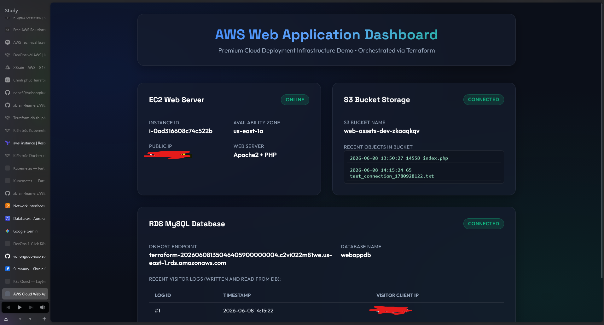
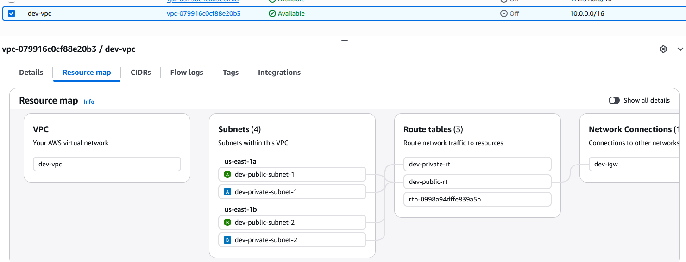
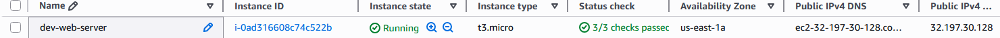
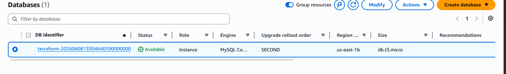
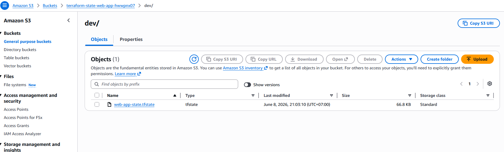
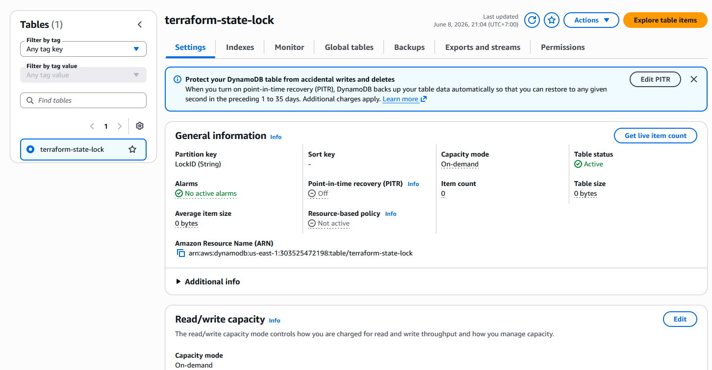

# AWS Web Application Infrastructure with Terraform

Dự án này sử dụng Terraform để tự động hóa việc triển khai một cơ sở hạ tầng web 2 lớp (2-tier web application) trên AWS bao gồm:
* **VPC**: Mạng ảo tùy chỉnh với 2 public subnets và 2 private subnets phân bổ trên 2 Availability Zones.
* **EC2 Web Server**: Chạy hệ điều hành Ubuntu, cài đặt Apache2, PHP và AWS CLI. Nhận mã nguồn web (`index.php`) từ S3.
* **S3 Bucket**: Lưu trữ tĩnh các tài nguyên của web (như file `index.php`).
* **RDS MySQL Database**: Cơ sở dữ liệu chạy trên subnet riêng tư (private subnet), chỉ cho phép kết nối từ Web Server qua Security Group.
* **IAM Role & Instance Profile**: Cho phép EC2 giao tiếp an toàn với S3 Bucket để tải tài nguyên mà không cần lưu trữ AWS access keys trên EC2.
* **SSH Key Pair**: Tự động tạo và phân quyền cho file key `web-key.pem` để SSH vào Web Server.

---

## 📋 Yêu cầu chuẩn bị (Prerequisites)

1. **Terraform**: Đã cài đặt phiên bản `>= 1.0.0` trên máy cá nhân.
2. **AWS CLI & Account**: Đã cài đặt AWS CLI và cấu hình tài khoản AWS có đủ quyền quản trị (AdministratorAccess).
   * Chạy lệnh cấu hình thông tin xác thực:
     ```bash
     aws configure
     ```
     Nhập `AWS Access Key ID`, `AWS Secret Access Key` và mặc định region là `us-east-1` (hoặc region bạn muốn sử dụng).

---

## 🚀 Hướng dẫn các bước triển khai

Bạn có thể chọn một trong hai phương án quản lý file trạng thái (State) bên dưới:

### 🔹 Phương án A: Triển khai nhanh với Local State (Khuyên dùng khi học tập/thử nghiệm)

Với phương án này, file trạng thái `terraform.tfstate` sẽ được lưu trực tiếp trên máy của bạn.

1. **Khởi tạo Terraform:**
   Mở terminal tại thư mục chứa dự án (`CDO_Terraform`) và chạy lệnh:
   ```bash
   terraform init
   ```
2. **Kiểm tra kế hoạch triển khai:**
   ```bash
   terraform plan
   ```
3. **Tiến hành triển khai hạ tầng:**
   ```bash
   terraform apply -auto-approve
   ```
   *(Đợi khoảng 3-5 phút để AWS khởi tạo VPC, RDS Database, S3 Bucket và EC2)*

---

### 🔹 Phương án B: Triển khai với Remote State (Chuẩn Production)

Phương án này sử dụng một S3 Bucket làm nơi lưu trữ State tập trung và DynamoDB Table để khóa trạng thái (State Locking), tránh xung đột khi làm việc nhóm.

1. **Khởi tạo và tạo tài nguyên Bootstrap:**
   Di chuyển vào thư mục `bootstrap` để tạo S3 bucket và DynamoDB lock table:
   ```bash
   cd bootstrap
   terraform init
   terraform apply -auto-approve
   ```
2. **Lưu lại thông tin:**
   Sau khi apply thành công, bạn sẽ thấy output chứa tên S3 bucket. Hãy copy lại giá trị đó (ví dụ: `terraform-state-web-app-xxxxxxxx`).
3. **Quay lại thư mục gốc:**
   ```bash
   cd ..
   ```
4. **Cấu hình file `backend.tf`:**
   Mở file [backend.tf](backend.tf) ở thư mục gốc, bỏ dấu chú thích (`#`) từ dòng 14 đến dòng 22, và cập nhật giá trị `bucket` bằng tên bucket bạn vừa lưu ở bước 2:
   ```hcl
   terraform {
     backend "s3" {
       bucket         = "terraform-state-web-app-xxxxxxxx" # Thay thế bằng bucket của bạn
       key            = "dev/web-app-state.tfstate"
       region         = "us-east-1"
       dynamodb_table = "terraform-state-lock"
       encrypt        = true
     }
   }
   ```
5. **Chuyển đổi trạng thái sang Remote State:**
   Chạy lệnh init với cờ chuyển đổi trạng thái:
   ```bash
   terraform init -migrate-state
   ```
   *(Nhập `yes` khi được hỏi để xác nhận chuyển đổi file state từ local lên S3)*
6. **Triển khai hạ tầng:**
   ```bash
   terraform apply -auto-approve
   ```

---

## 🌐 Truy cập và Kiểm tra ứng dụng

1. **Lấy địa chỉ URL:**
   Sau khi chạy `terraform apply` thành công, terminal sẽ in ra danh sách các **Outputs**. Hãy tìm dòng có tên:
   * **`web_server_url`**: Ví dụ `http://54.89.20.150`
   * **`web_server_public_ip`**: Địa chỉ IP công cộng của EC2 Web Server.
2. **Truy cập qua trình duyệt:**
   Copy URL `http://<IP_PUBLIC>/index.php` dán vào trình duyệt web của bạn để kiểm tra.
3. **⚠️ Lưu ý quan trọng về thời gian cài đặt (Bootstrap Delay):**
   * Sau khi Terraform chạy xong, EC2 Instance cần khoảng **1 - 3 phút** để chạy đoạn script cài đặt web server Apache, PHP và tải file code `index.php` từ S3.
   * Nếu bạn truy cập ngay lập tức và thấy trang mặc định của Apache hoặc lỗi kết nối, **vui lòng đợi 1-2 phút rồi F5 (reload) lại trang**.

---

## 🔑 Truy cập SSH vào Web Server (Nếu cần thiết)

Terraform tự động tạo private key dạng file PEM tên là `web-key.pem` ở thư mục gốc và cấu hình phân quyền chỉ đọc (0600) cho user hiện tại. Bạn có thể kết nối SSH tới EC2 qua lệnh:

```bash
ssh -i web-key.pem ubuntu@<WEB_SERVER_PUBLIC_IP>
```

---

## 🗑️ Dọn dẹp tài nguyên (Teardown)

Khi không sử dụng nữa, hãy dọn dẹp các tài nguyên để tránh phát sinh chi phí ngoài ý muốn:

1. **Hủy toàn bộ tài nguyên hạ tầng chính:**
   Tại thư mục gốc, chạy lệnh:
   ```bash
   terraform destroy -auto-approve
   ```
2. **Hủy tài nguyên Bootstrap (Nếu dùng Phương án B):**
   Nếu bạn đã cấu hình remote state, trước tiên hãy comment lại khối `backend "s3"` trong file `backend.tf` và chạy lệnh `terraform init -migrate-state` để đưa state về local, sau đó vào thư mục `bootstrap` để dọn dẹp:
   ```bash
   cd bootstrap
   terraform destroy -auto-approve
   ```

---

## 📷 Hình ảnh minh họa kết quả triển khai (Screenshots)

Dưới đây là một số hình ảnh thực tế sau khi triển khai thành công hạ tầng trên AWS:

### 1. Giao diện Web Application Dashboard


### 2. Các tài nguyên VPC và Subnets


### 3. Thông tin máy chủ EC2 Web Server


### 4. Cơ sở dữ liệu RDS MySQL Database


### 5. S3 Bucket lưu trữ Terraform State


### 6. DynamoDB Table khóa trạng thái (State Lock)


