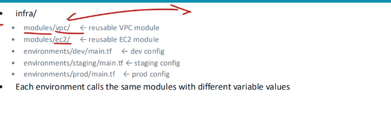

State: Terraform Lưu Gì, Vì Sao Cần, và Drift

Vì sao Terraform cần state
Ánh xạ với thực tế: Cấu hình của bạn viết aws_s3_bucket.demo, còn AWS chỉ biết một bucket tên tf-series-bai4-2026.... State là cầu nối giữa hai tên đó: nó ghi "resource local tên demo chính là bucket id này". Không có ánh xạ này, Terraform không biết khi bạn sửa block demo thì phải đụng vào bucket nào trên AWS. 
Metadata về phụ thuộc. State lưu cả quan hệ phụ thuộc giữa các resource. Điều này quan trọng nhất lúc xóa: khi bạn gỡ một resource khỏi cấu hình, nó không còn trong file để Terraform suy ra thứ tự xóa, nên thứ tự đó phải được nhớ trong state từ trước.
Hiệu năng. State cache lại thuộc tính của mọi resource. Với hạ tầng lớn (hàng trăm, hàng nghìn resource), hỏi lại từng cái qua API mỗi lần plan là quá chậm vì độ trễ mạng và giới hạn rate limit. State cho phép Terraform tính kế hoạch dựa trên bản cache, chỉ refresh khi cần.
Đồng bộ nhóm. Khi nhiều người cùng làm trên một hạ tầng, state đặt ở nơi chung (remote) đảm bảo ai cũng làm việc trên cùng một bản, và khóa lại để hai người không apply đè lên nhau

State lưu gì

$ terraform state list
aws_s3_bucket.demo

$ terraform state show aws_s3_bucket.demo
    bucket                      = "tf-series-bai4-20260525025632034200000001"
    hosted_zone_id              = "Z3O0J2DXBE1FTB"
    id                          = "tf-series-bai4-20260525025632034200000001"
    tags                        = {
        "Env"     = "dev"
        "Project" = "terraform-series"
    }
state list liệt kê mọi resource Terraform đang quản lý theo địa chỉ local. state show <địa_chỉ> in toàn bộ thuộc tính của một resource đúng như đã ghi trong state. Đây không phải Terraform hỏi AWS — nó đọc từ file state đã cache.

Refesh: so ba chiều
Mỗi lần plan (và apply), trước khi tính diff, Terraform làm bước refresh: với mỗi resource trong state, nó gọi provider hỏi AWS xem resource đó hiện ra sao, rồi cập nhật bản đọc về trong bộ nhớ

Drift: khi thực tế lệch khỏi cấu hình
Drift là khi ai đó sửa hạ tầng ngoài Terraform — bấm console lúc xử lý sự cố, chạy aws CLI tay, hoặc một công cụ khác đụng vào
vd: Đổi tag Env từ dev sang production bằng AWS CLI, hoàn toàn sau lưng Terraform. Khi chạy plan

$ terraform plan
aws_s3_bucket.demo: Refreshing state... [id=tf-series-bai4-20260525025632034200000001]

  ~ update in-place

  # aws_s3_bucket.demo will be updated in-place
  ~ resource "aws_s3_bucket" "demo" {
        id   = "tf-series-bai4-20260525025632034200000001"
      ~ tags = {
          ~ "Env"     = "production" -> "dev"
            "Project" = "terraform-series"
        }
    }

Plan: 0 to add, 1 to change, 0 to destroy.

Ký hiệu ~ nghĩa là "sửa tại chỗ". Terraform thấy thực tế là production nhưng cấu hình nói dev, nên nó đề xuất kéo thực tế về dev: "production" -> "dev". Mọi thay đổi tay sẽ bị apply tiếp theo san phẳng về đúng cái đã viết. Nếu chạy terraform apply lúc này, tag quay lại dev

Hai lựa chọn khi gặp drift
Đôi khi thay đổi đó là đúng và bạn muốn chấp nhận nó. Terraform có chế độ -refresh-only: chỉ đồng bộ state cho khớp thực tế, không sửa hạ tầng.

$ terraform plan -refresh-only

LƯU Ý:
File state chứa mọi thuộc tính của resource ở dạng văn bản thường, kể cả những giá trị nhạy cảm như mật khẩu database hay private key. Bất kỳ ai đọc được file state đều đọc được chúng. Hệ quả thực tế: tuyệt đối không commit terraform.tfstate vào git, và khi làm việc nhóm phải cất state ở nơi mã hóa, kiểm soát truy cập. 

Tổng kết

State tồn tại vì bốn lý do: ánh xạ tên local với resource thật, nhớ phụ thuộc để xóa đúng thứ tự, cache thuộc tính cho nhanh, và đồng bộ khi làm nhóm. Mỗi plan bắt đầu bằng refresh — đọc thực tế rồi so ba chiều giữa cấu hình, state và AWS. Khi lệch, plan thường kéo thực tế về cấu hình (~ ... -> giá_trị_cấu_hình), còn -refresh-only ghi thực tế vào state mà không sửa hạ tầng. File state là plaintext nên phải giữ kín.

Đồ Thị Phụ Thuộc: Implicit, depends_on, và -target

Tại sao cần IaC?
tính nhất quán
Tốc độ, ko cần thao tác nhiều
Quản lí phiên bản, ai thay đổi và lí do
Cộng tác nhiều được nhiều bên, theo team và member làm từng phần nhỏ trong template lớn

HCL:
    Block types:
        Resource: EC2
        Variable:tùy chỉnh các tham số của cơ sở hạ tầng hoặc mã nguồn mà không cần phải thay đổi mã trực tiếp
        Output: hiện thêm hoặc sửa những gì, review trc
        Locals: thực hiện phép tính locals
        modules: hàm, tái sử dụng những đoạn code

Common mistake
- committing tfstate to Git
- 2 người dùng apply cùng lúc -> dùng dynamo để quản lí (remote state)
- lỡ xoá file resource thủ công
- lỡ xoá file tfstate no backup -> gây duplicate resource ->  Bật s3 versioning lên để backup

Modules
-Tránh duplicate resource
- Tái sử dụng mới đưa vào modules

source docs
https://devopsvn.tech/terraform-series/terraform