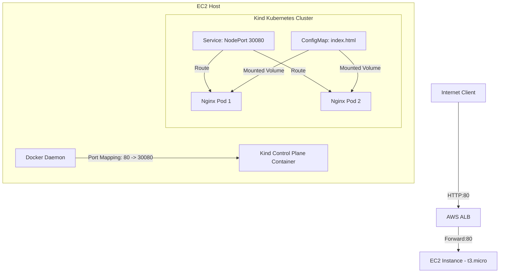

# K8s on AWS — Terraform 1-Click

Dự án này tự động hóa hoàn toàn (1-click) việc khởi tạo hạ tầng AWS (VPC, Security Groups, ALB, EC2 `t3.micro`) và tự động cấu hình Kubernetes (`kind`), sau đó deploy một ứng dụng web Nginx đơn giản hiển thị giao diện tối giản, hiện đại và expose ra ngoài Internet thông qua Application Load Balancer (ALB).

---

## 1. Sơ đồ kiến trúc (Architecture)

Dưới đây là mô hình luồng dữ liệu (traffic flow) đi từ Internet qua ALB vào ứng dụng chạy trong cụm K8s bên trong EC2:



---

## 2. Hướng dẫn chạy (Execution Commands)

Để khởi tạo toàn bộ hệ thống từ một thư mục sạch (clean repo), hãy thực hiện các lệnh sau:

### Khởi tạo & Triển khai
```bash
# 1. Khởi tạo Terraform và tải về các provider (aws, kubernetes, tls, local)
terraform init

# 2. Kiểm tra tính hợp lệ của cấu hình
terraform validate

# 3. Triển khai hạ tầng và ứng dụng (1-Click Automation)
terraform apply -auto-approve
```

*Sau khi apply thành công, Terraform sẽ trả về output gồm link `alb_dns_name`. Bạn chỉ cần click vào link này để mở ứng dụng trên trình duyệt.*

### Dọn dẹp tài nguyên
```bash
# 4. Hủy toàn bộ tài nguyên trên AWS để tránh phát sinh chi phí
terraform destroy -auto-approve
```

---

## 3. Giải thích cách Wire Provider (Multi-Provider Wiring)

Thử thách lớn nhất trong mô hình **1-Click** tự dựng hạ tầng K8s trên EC2 là: **Làm sao để provider `kubernetes` có thể plan và kết nối tới cụm K8s khi mà EC2 instance và file `kubeconfig` chưa hề tồn tại ở bước `terraform plan`?**

Chúng tôi giải quyết bài toán này thông qua kỹ thuật **Dynamic Provider Configuration & Orchestrated Bootstrapping**:

### Bước 1: Trì hoãn việc khởi tạo Kubernetes Provider (Deferred Planning)
Thay vì sử dụng file kubeconfig tĩnh có sẵn, cấu hình của `kubernetes` provider được trỏ tới một file động phụ thuộc trực tiếp vào thuộc tính của EC2 instance:
```hcl
locals {
  kubeconfig_path = "${path.module}/kubeconfig_${aws_instance.k8s_node.id}.yaml"
}

provider "kubernetes" {
  config_path = local.kubeconfig_path
}
```
Vì `aws_instance.k8s_node.id` là giá trị chỉ biết sau khi apply (`known after apply`), đường dẫn `config_path` cũng trở thành computed. Điều này báo cho Terraform biết cần hoãn việc lập kế hoạch (`plan`) cho toàn bộ các tài nguyên sử dụng provider `kubernetes` (Deployment, Service, ConfigMap) và chỉ đánh giá chúng ở phase `apply` sau khi EC2 đã dựng xong.

### Bước 2: Đồng bộ hóa quá trình khởi tạo K8s (Orchestrated Bootstrapping)
Chúng tôi sử dụng một tài nguyên trung gian `terraform_data.wait_for_k8s` để kiểm soát thứ tự chạy:
1. **EC2 Bootstrapping**: EC2 instance được tạo và khởi chạy đoạn script `user_data` cài đặt Docker, `kubectl`, `kind` và khởi tạo cụm cluster lắng nghe trên cổng `6443`.
2. **SSM/SSH Connection Waiting**: Tài nguyên `terraform_data.wait_for_k8s` gọi script PowerShell [wait_k8s.ps1](wait_k8s.ps1) chạy ở máy local. Script này sẽ liên tục ping SSH vào EC2 instance cho tới khi lệnh `sudo kind get kubeconfig` trả về kết quả hợp lệ.
3. **Kubeconfig Rewriting & Local Writing**: Khi K8s đã sẵn sàng, script SSH lấy file kubeconfig gốc từ cụm, thay thế endpoint `https://127.0.0.1:6443` (hoặc `0.0.0.0`) thành địa chỉ IP công cộng của EC2 (`https://<public_ip>:6443`), và ghi đè trực tiếp xuống đĩa máy local tại đường dẫn `kubeconfig_${aws_instance.k8s_node.id}.yaml`.
4. **Provider Activation**: Ngay sau khi file kubeconfig được lưu trên máy local, `kubernetes` provider được nạp file cấu hình chuẩn này và tiến hành deploy các tài nguyên K8s (Deployment, Service, ConfigMap) lên cụm một cách mượt mà.

---

## 4. Các điểm tối ưu kỹ thuật khác

*   **Khắc phục giới hạn RAM của `t3.micro`**: Cấu hình thêm **2 GB swap space** giúp EC2 có tổng cộng 3 GB bộ nhớ ảo, đảm bảo chạy ổn định control plane của K8s mà không bị lỗi Out-Of-Memory (OOM).
*   **ALB Target Group Direct Port-Mapping**:
    *   Ứng dụng được expose qua cổng `30080` (NodePort) trên K8s.
    *   Cụm `kind` được cấu hình map cổng `80` của EC2 host vào cổng `30080` của container control plane.
    *   Target Group của ALB trỏ trực tiếp vào cổng `80` của EC2 instance. 
    *   Nhờ đó, luồng mạng đi trực tiếp từ ALB qua cổng 80 của EC2 thẳng vào Pod mà không cần cài thêm Ingress Controller phức tạp trên K8s.
*   **Dọn dẹp tự động (Auto-Cleanup)**: Khi chạy `terraform destroy`, provisioner phá hủy của `terraform_data` sẽ tự động dọn dẹp sạch sẽ các file `kubeconfig_*.yaml` tạm thời trên máy local của bạn.
