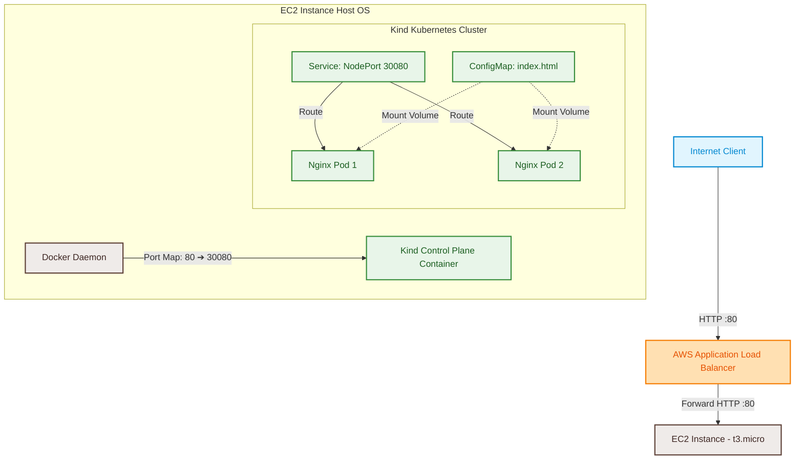
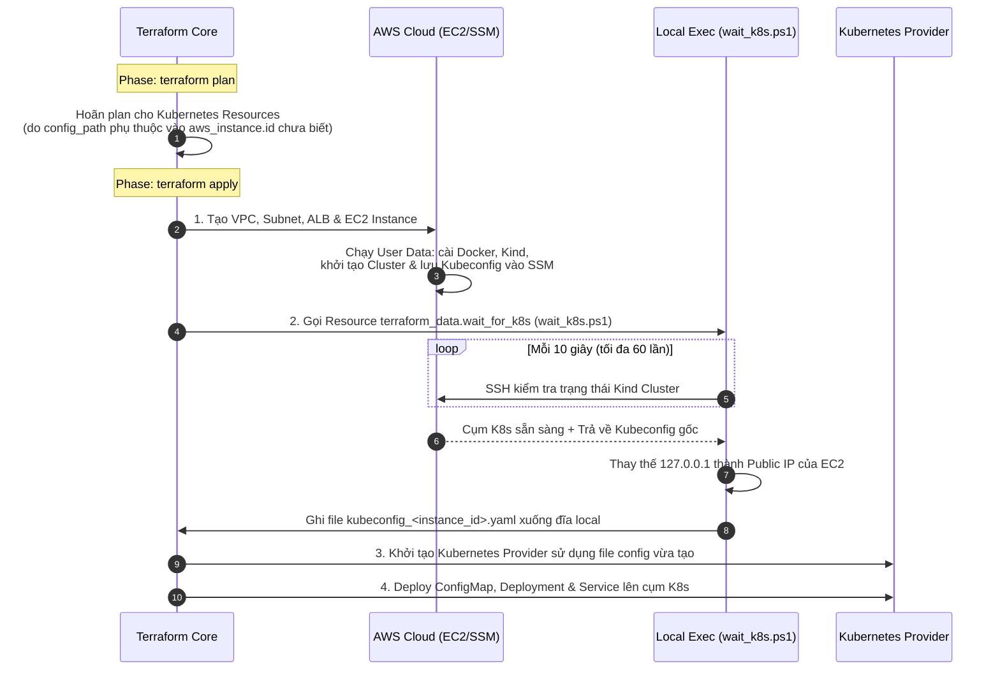

# K8s on AWS — Terraform 1-Click

Dự án này tự động hóa hoàn toàn (1-click) việc khởi tạo hạ tầng AWS (VPC, Subnets, Security Groups, Application Load Balancer, EC2 Instance `t3.micro`) và tự động cấu hình cụm Kubernetes (`kind`), sau đó deploy một ứng dụng web Nginx với giao diện hiện đại, tối giản và expose ra ngoài Internet thông qua AWS Application Load Balancer (ALB).

---

## 1. Sơ đồ kiến trúc (Architecture Diagram)

Dưới đây là mô hình luồng dữ liệu (traffic flow) và kiến trúc kết nối đi từ Internet qua Application Load Balancer (ALB) vào ứng dụng chạy trong cụm Kubernetes (Kind) bên trong EC2 Instance:



### Chi tiết luồng dữ liệu (Traffic Flow Details):
1. **Client** gửi request HTTP đến DNS của **AWS ALB** trên cổng `80`.
2. **ALB** nhận traffic và chuyển tiếp (forward) đến cổng `80` của **EC2 Instance** (thông qua Target Group Attachment).
3. Tại **EC2 Instance**, Docker daemon đã được cấu hình port-mapping để forward tất cả traffic từ cổng `80` của Host OS vào cổng `30080` của **Kind Control Plane container**.
4. Bên trong **Kind Cluster**, Service loại `NodePort` lắng nghe trên cổng `30080` sẽ phân phối và cân bằng tải traffic đến các **Nginx Pods** (port `80`) chạy ứng dụng web.
5. Nội dung trang web được gắn động vào Pods thông qua Kubernetes `ConfigMap` chứa file `index.html` tùy chỉnh.

---

## 2. Giải thích cách Wire Provider (Multi-Provider Wiring)

Thử thách lớn nhất trong mô hình **1-Click** tự động hóa hoàn toàn từ hạ tầng AWS đến ứng dụng Kubernetes là: **Làm sao để provider `kubernetes` có thể plan và kết nối tới cụm K8s khi mà EC2 instance và file `kubeconfig` chưa hề tồn tại ở bước `terraform plan`?**

Giải pháp được thực hiện thông qua cơ chế **Dynamic Provider Configuration & Orchestrated Bootstrapping**:



### Bước 1: Trì hoãn việc khởi tạo Kubernetes Provider (Deferred Planning)
Thông thường, Terraform yêu cầu provider phải kết nối được vào cụm K8s ngay từ bước `plan`. Để phá vỡ ràng buộc này, cấu hình của `kubernetes` provider được thiết lập phụ thuộc vào tài nguyên đồng bộ `terraform_data.wait_for_k8s` và ID của EC2 instance:
```hcl
provider "kubernetes" {
  config_path = terraform_data.wait_for_k8s.id != "" ? "${path.module}/kubeconfig_${aws_instance.k8s_node.id}.yaml" : null
}
```
Vì `aws_instance.k8s_node.id` và `terraform_data.wait_for_k8s.id` là các giá trị chỉ được xác định sau khi apply (`known after apply`), Terraform hiểu rằng cấu hình của `kubernetes` provider chưa thể xác định được tại bước `plan`. Do đó, Terraform sẽ tự động **trì hoãn (defer) việc lập kế hoạch cho toàn bộ các tài nguyên sử dụng provider này** (Deployment, Service, ConfigMap) và chỉ đánh giá chúng ở phase `apply` sau khi hạ tầng bên dưới đã sẵn sàng.

### Bước 2: Đồng bộ hóa quá trình khởi tạo K8s (Orchestrated Bootstrapping)
Chúng tôi sử dụng một tài nguyên trung gian `terraform_data.wait_for_k8s` để kiểm soát thứ tự chạy:
1. **EC2 Bootstrapping**: EC2 instance khởi chạy, thực thi đoạn script `user_data` để kích hoạt swap (tránh OOM), cài đặt Docker, `kubectl`, `kind`, và tạo cụm K8s lắng nghe trên cổng `6443` (với Public IP được cấu hình trong `certSANs` để bảo mật TLS).
2. **SSM & Local Polling**: Tài nguyên `terraform_data.wait_for_k8s` gọi script PowerShell [wait_k8s.ps1](wait_k8s.ps1) chạy local. Script này liên tục ping SSH vào EC2 instance bằng private key `k8s-key.pem` cho tới khi lệnh `sudo kind get kubeconfig` trả về kết quả hợp lệ.
3. **Kubeconfig Rewriting & Local Writing**: Khi K8s đã sẵn sàng, script SSH lấy file kubeconfig gốc từ cụm, thay thế endpoint loopback (`127.0.0.1:6443`, `localhost:6443` hoặc `0.0.0.0:6443`) thành địa chỉ IP công cộng của EC2 (`https://<public_ip>:6443`), và ghi đè trực tiếp xuống đĩa local tại đường dẫn `kubeconfig_${aws_instance.k8s_node.id}.yaml`.
4. **Provider Activation**: Ngay sau khi file kubeconfig xuất hiện trên đĩa local, `kubernetes` provider được kích hoạt thành công và tiến hành triển khai các tài nguyên K8s lên cụm.

---

## 3. Hướng dẫn chạy (Execution Commands)

### Yêu cầu hệ thống (Prerequisites)
*   **Hệ điều hành**: Windows (để chạy script PowerShell `wait_k8s.ps1` thông qua `local-exec`).
*   **Công cụ**: 
    *   Terraform (phiên bản `>= 1.0.0`).
    *   AWS CLI (đã được cấu hình quyền truy cập đầy đủ).
    *   OpenSSH client (lệnh `ssh` có thể chạy được từ PowerShell).

### Các bước triển khai

```powershell
# 1. Khởi tạo thư mục và tải các provider cần thiết (aws, kubernetes, tls, local)
terraform init

# 2. Kiểm tra tính hợp lệ của cấu hình Terraform
terraform validate

# 3. Xem trước kế hoạch triển khai hạ tầng
terraform plan

# 4. Triển khai tự động hoàn toàn (1-Click)
terraform apply -auto-approve
```

*Sau khi triển khai thành công, Terraform sẽ hiển thị output chứa đường link của Load Balancer. Bạn chỉ cần click vào link `alb_dns_name` để truy cập vào ứng dụng web.*

### Kiểm tra trạng thái cụm K8s từ máy local
Bạn có thể sử dụng file kubeconfig động được sinh ra để tương tác trực tiếp với cụm K8s bên trong EC2:

```powershell
# Tìm tên file kubeconfig được tạo ra trong thư mục
Get-ChildItem -Filter kubeconfig_*.yaml

# Xem trạng thái các Node trong cụm
kubectl --kubeconfig kubeconfig_<EC2_INSTANCE_ID>.yaml get nodes

# Xem trạng thái các Pods và Services
kubectl --kubeconfig kubeconfig_<EC2_INSTANCE_ID>.yaml get pods -o wide
kubectl --kubeconfig --namespace default get service web-service
```

### Dọn dẹp tài nguyên
Để tránh phát sinh chi phí AWS, hãy chạy lệnh sau để hủy toàn bộ tài nguyên:

```powershell
terraform destroy -auto-approve
```

---

## 4. Các điểm tối ưu kỹ thuật khác

*   **Chống lỗi cạn kiệt bộ nhớ (OOM Prevention)**: EC2 `t3.micro` chỉ có 1 GB RAM, không đủ để chạy control plane của K8s. Đoạn script `user_data` tự động cấu hình **2 GB swap space** (tổng cộng 3 GB bộ nhớ ảo), giúp cụm Kind hoạt động cực kỳ ổn định.
*   **Tránh Deadlock khi Destroy**: 
    > [!WARNING]
    > Khi chạy `terraform destroy`, nếu hạ tầng mạng AWS (Internet Gateway, Route Table) bị xóa trước hoặc song song với các tài nguyên Kubernetes, máy local của bạn sẽ mất kết nối SSH/API tới EC2. Điều này làm cho provider `kubernetes` bị treo timeout liên tục khi cố gắng xóa Deployment/Service, dẫn đến lỗi `DependencyViolation` và kẹt tiến trình xóa AWS Internet Gateway.
    >
    > **Giải pháp**: Tất cả các tài nguyên Kubernetes (`kubernetes_config_map`, `kubernetes_deployment`, `kubernetes_service`) đều được cấu hình thuộc tính `depends_on` trỏ đến `aws_route_table_association` và `aws_security_group` của EC2. Điều này bắt buộc Terraform phải xóa sạch các ứng dụng K8s trước khi chạm vào hạ tầng mạng AWS, loại bỏ hoàn toàn deadlock.
*   **Tự động dọn dẹp (Auto-Cleanup)**: Khi chạy `terraform destroy`, provisioner hủy của `terraform_data.wait_for_k8s` sẽ tự động xóa file private key `k8s-key.pem` và file `kubeconfig_*.yaml` tạm thời trên máy local của bạn để giữ thư mục làm việc luôn sạch sẽ.

