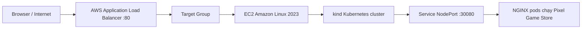
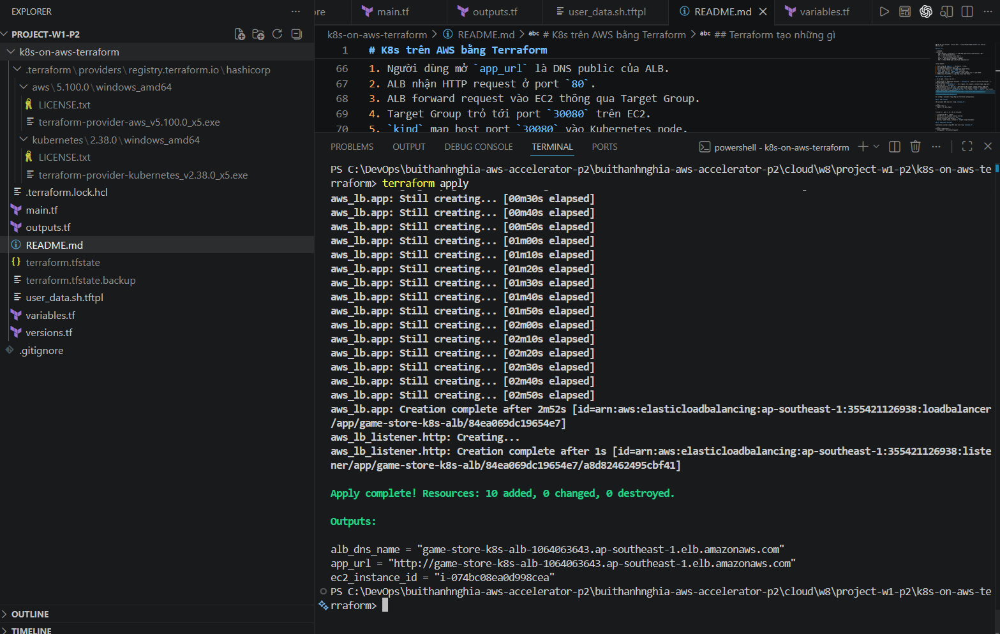
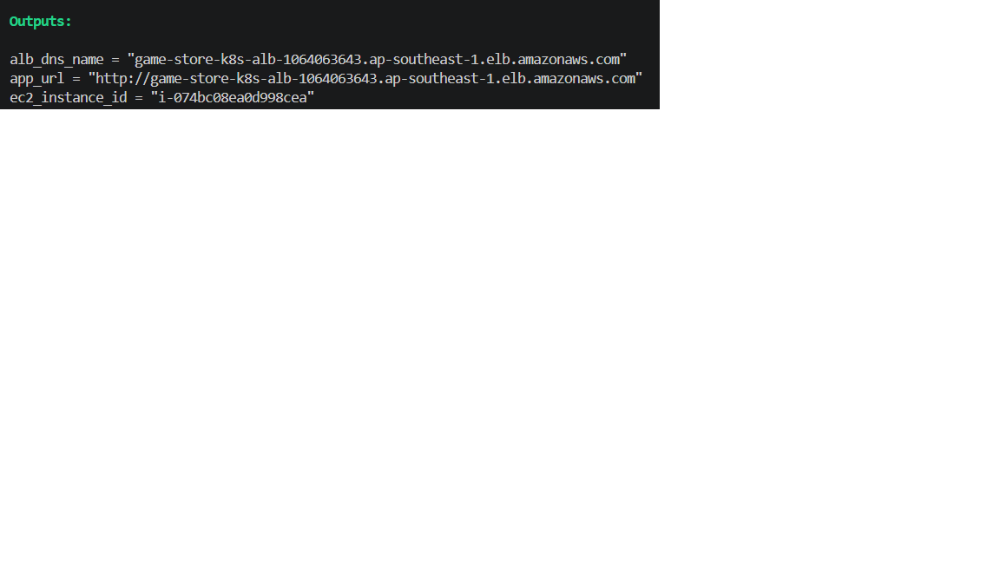
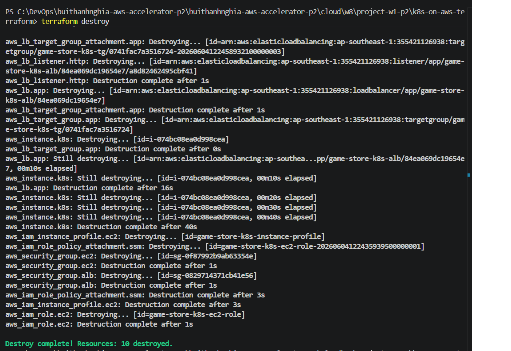

# K8s trên AWS bằng Terraform

Dự án này dùng Terraform để dựng một môi trường Kubernetes nhỏ trên AWS, deploy
ứng dụng demo **Pixel Game Store** vào Kubernetes, rồi public ứng dụng ra Internet
qua **AWS Application Load Balancer (ALB)**.

Điểm chính của bài:

- Chạy từ repo sạch bằng một lệnh Terraform.
- Ứng dụng chạy trong Kubernetes bằng `kind`, không cài trực tiếp trên EC2.
- ALB public nhận request HTTP và forward vào Kubernetes NodePort.
- Terraform khai báo và wire tối thiểu 2 provider trong cùng cấu hình:
  `hashicorp/aws` và `hashicorp/kubernetes`.
- Có lệnh kiểm chứng URL ALB và lệnh destroy để dọn sạch tài nguyên.

## Chạy nhanh từ repo sạch

Yêu cầu trước khi chạy:

- Đã cài Terraform `>= 1.6.0`.
- Máy local đã cấu hình AWS credentials.
- AWS account có quyền tạo EC2, IAM, Security Group, ALB và Target Group.
- Region đang dùng có default VPC với ít nhất 2 subnet.

Region mặc định của bài là:

```hcl
ap-southeast-1
```

Từ thư mục repo này, chạy đúng một dòng dưới đây để init, plan và apply:

```powershell
terraform init;
terraform plan;
terraform apply -auto-approve
```
Sau khi apply xong, lấy URL ứng dụng:

```powershell
terraform output -raw app_url
```

Mở URL đó trên browser. Kết quả đạt là trang **Pixel Game Store** hiển thị qua
DNS của ALB.

## Kiến trúc



Luồng request:

1. Người dùng mở `app_url` là DNS public của ALB.
2. ALB nhận HTTP request ở port `80`.
3. ALB forward request vào EC2 thông qua Target Group.
4. Target Group trỏ tới port `30080` trên EC2.
5. `kind` map host port `30080` vào Kubernetes node.
6. Kubernetes `Service` loại `NodePort` route request tới các pod NGINX.
7. NGINX serve file HTML của ứng dụng Pixel Game Store.

## Terraform tạo những gì

| Thành phần | File | Vai trò |
| --- | --- | --- |
| AWS provider và Kubernetes provider | `versions.tf` | Khai báo version Terraform và 2 provider dùng trong bài. |
| Biến cấu hình | `variables.tf` | Chứa region, tên project, instance type, app port, kubeconfig path và tag chung. |
| AWS infrastructure | `main.tf` | Tạo default VPC lookup, subnet lookup, IAM role, instance profile, security group, EC2, ALB, target group, listener và attachment. |
| App source | `app/` | Chứa `index.html` và `Dockerfile`, giống một project static web nhỏ. |
| Kubernetes manifest | `k8s/game-store.yaml.tftpl` | Khai báo `Deployment` và `Service NodePort`, không nhúng HTML trực tiếp vào YAML. |
| Bootstrap Kubernetes | `user_data.sh.tftpl` | Cài Docker, `kind`, `kubectl`, tạo cluster `kind`, build image local, load image vào kind rồi deploy app vào Kubernetes. |
| Kubernetes provider proof | `kubernetes.tf` | Tạo một `ConfigMap` nhỏ bằng Kubernetes provider khi bật biến opt-in. |
| Output | `outputs.tf` | Xuất `alb_dns_name`, `app_url`, `ec2_instance_id`. |

## Provider được wire như thế nào

Dự án dùng 2 provider trong cùng một Terraform configuration.

### 1. AWS provider

AWS provider được khai báo trong `versions.tf`:

```hcl
provider "aws" {
  region = var.aws_region
}
```

Provider này quản lý toàn bộ hạ tầng AWS:

- Tìm default VPC và subnet.
- Tạo IAM role và instance profile cho EC2.
- Tạo Security Group cho ALB và EC2.
- Tạo EC2 instance chạy Docker và `kind`.
- Tạo ALB, Target Group, Listener và Target Group Attachment.

### 2. Kubernetes provider

Kubernetes provider cũng được khai báo trong `versions.tf`:

```hcl
provider "kubernetes" {
  config_path = var.kubeconfig_path
}
```

Provider này được wire bằng `config_path = var.kubeconfig_path`, nghĩa là
Terraform sẽ dùng kubeconfig ở đường dẫn đó để nói chuyện với Kubernetes API.
Repo có một resource thật do provider này quản lý trong `kubernetes.tf`:

```hcl
resource "kubernetes_config_map_v1" "provider_wire_proof" {
  count = var.enable_kubernetes_provider_resource ? 1 : 0
}
```

Biến `enable_kubernetes_provider_resource` mặc định là `false` để luồng one-click
chính không bị phụ thuộc vào việc máy local có truy cập được Kubernetes API nằm
bên trong EC2 hay chưa. Khi `kubeconfig_path` đã trỏ tới một cluster truy cập
được, bật biến này sẽ tạo `ConfigMap` `terraform-provider-wire-proof` bằng chính
Kubernetes provider.

Trong bài này, cluster `kind` được tạo bên trong EC2 ở bước bootstrap nên manifest
ứng dụng chính vẫn được apply bằng `kubectl` trong `user_data.sh.tftpl`. Cách này
giúp bài chạy reproducible bằng một lần `terraform apply`: Terraform tạo EC2
trước, EC2 tự bootstrap `kind`, rồi deploy app ngay trong cùng luồng khởi tạo.
Nếu bắt Kubernetes provider quản lý trực tiếp `Deployment` và `Service`, Terraform
local phải truy cập được kubeconfig của cluster `kind` nằm trong EC2, làm bài lab
phức tạp hơn và ảnh hưởng đến yêu cầu one-click.

## Vì sao chọn kiến trúc này

Mục tiêu của bài là chứng minh app chạy thật trong Kubernetes nhưng vẫn giữ repo
nhỏ, dễ chạy lại và dễ destroy.

- Dùng `kind` trên một EC2 giúp không cần tạo EKS, tiết kiệm chi phí cho bài lab.
- Dùng ALB giúp URL public ổn định hơn so với truy cập thẳng public IP của EC2.
- EC2 không chạy app trực tiếp. EC2 chỉ đóng vai trò host cho Docker và cluster
  `kind`.
- App nằm trong thư mục `app/`, được build thành Docker image local rồi deploy bằng Kubernetes `Deployment` và `Service`.
- ALB chỉ được phép gọi vào port NodePort, còn app traffic đi tiếp qua
  Kubernetes Service tới pod.
- Toàn bộ tài nguyên AWS nằm trong Terraform state nên có thể destroy sạch.

## Kiểm chứng sau khi deploy

Lấy URL:

```powershell
terraform output -raw app_url
```

Gọi thử URL ALB:

```powershell
curl.exe (terraform output -raw app_url)
```

Kết quả đạt:

- Browser mở được trang **Pixel Game Store**.
- `curl` trả về HTML có title hoặc nội dung của Pixel Game Store.
- ALB Target Group chuyển sang trạng thái healthy sau vài phút.

Có thể lấy EC2 instance ID để kiểm tra thêm:

```powershell
terraform output -raw ec2_instance_id
```

Nếu dùng AWS Systems Manager Session Manager để vào EC2, kiểm tra Kubernetes:

```bash
sudo kubectl get nodes
sudo kubectl get pods
sudo kubectl get svc
```

Kết quả mong đợi:

```text
NAME         TYPE       CLUSTER-IP      EXTERNAL-IP   PORT(S)
game-store   NodePort   ...             <none>        80:30080/TCP
```

Kiểm tra log bootstrap trên EC2:

```bash
sudo tail -n 100 /var/log/user-data.log
```

## Bằng chứng nộp bài

Khi nộp bài, có thể chụp ảnh hoặc quay clip các bước sau:

1. Chạy lệnh:

   ```powershell
   terraform init; if ($LASTEXITCODE -eq 0) { terraform apply -auto-approve }
   ```

2. Chạy:

   ```powershell
   terraform output -raw app_url
   ```

3. Mở URL ALB trên browser và thấy trang **Pixel Game Store**.

4. Kiểm tra app nằm trong Kubernetes:

   ```bash
   sudo kubectl get pods
   sudo kubectl get svc
   ```

5. Sau khi chấm hoặc demo xong, chạy destroy:

   ```powershell
   terraform destroy -auto-approve
   ```

## Hình minh chứng

### Hình 1 - Lệnh Terraform chạy thành công



*Ghi chú: Ảnh này chứng minh repo chạy được từ đầu bằng `terraform init` và
`terraform apply -auto-approve`, không cần thao tác thủ công trên AWS Console.*

### Hình 2 - Output URL của ALB



*Ghi chú: Ảnh này chứng minh Terraform đã tạo ALB và xuất ra URL public thông
qua output `app_url`.*

### Hình 3 - Mở được ứng dụng trên browser


*Ghi chú: Ảnh này chứng minh URL ALB mở được trang Pixel Game Store trên browser.*

### Hình 4 - App chạy trong Kubernetes


*Ghi chú: Ảnh này chứng minh app không chạy trực tiếp trên EC2 mà chạy trong
Kubernetes dưới dạng pod và được expose bằng Service NodePort.*

### Hình 5 - Destroy dọn sạch tài nguyên



*Ghi chú: Ảnh này chứng minh đã chạy `terraform destroy -auto-approve` sau khi
demo để dọn sạch tài nguyên AWS và tránh phát sinh chi phí.*

## Destroy để dọn sạch tài nguyên

Sau khi demo xong, chạy:

```powershell
terraform destroy -auto-approve
```

Lệnh này xóa các tài nguyên AWS do Terraform tạo, gồm:

- EC2 instance.
- IAM role và instance profile.
- Security Group.
- ALB.
- Target Group.
- Listener và Target Group Attachment.

Nên destroy ngay sau khi hoàn tất để tránh phát sinh chi phí hạ tầng.
