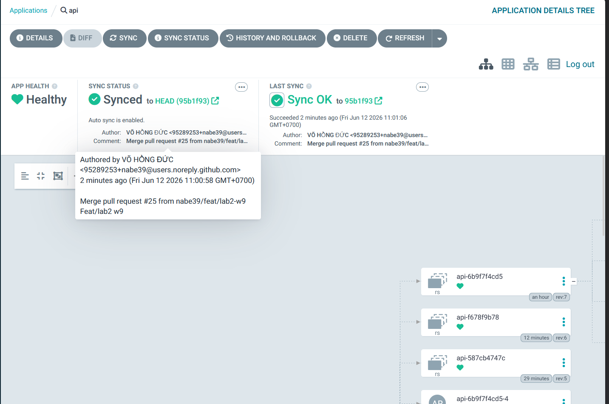
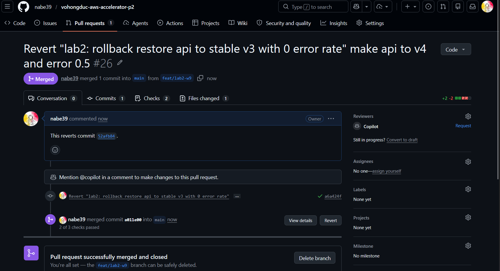
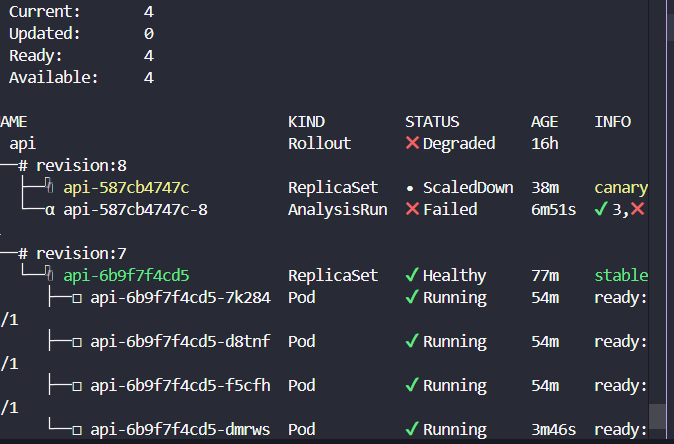
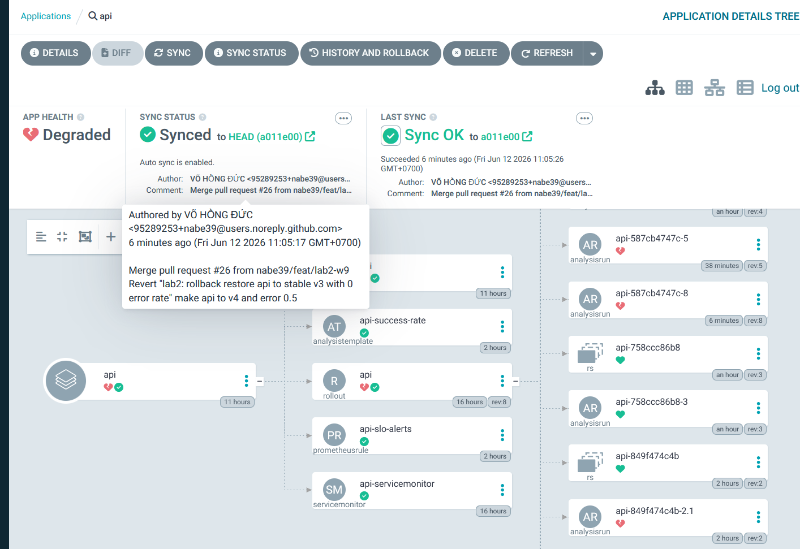
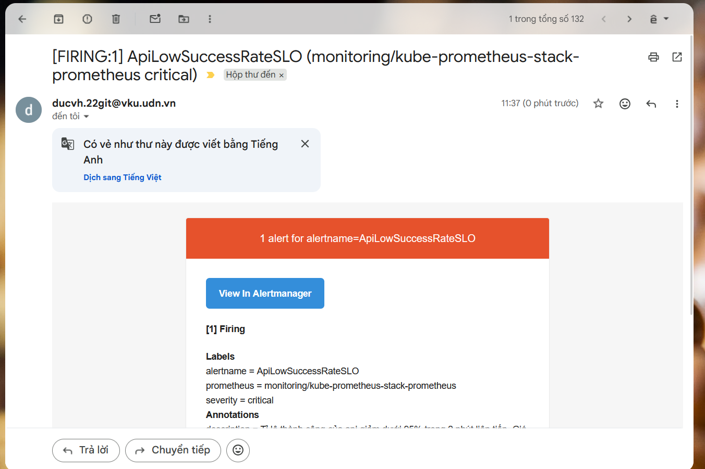

# Bảng Đánh Giá & Checklist Dự Án W9 (GitOps, Observability & Canary)

Tài liệu này đánh giá hiện trạng dự án dựa trên các tiêu chí chấm điểm tuần **W9** và cung cấp Checklist chi tiết các phần việc cần làm tiếp theo để hoàn thiện dự án đạt yêu cầu tối đa.

---

## 📊 Bảng Đánh Giá Hiện Trạng (Requirement Matrix)

| Tiêu chí đạt yêu cầu (ĐẠT - phải đủ cả 4) | Hiện trạng trong Repo | Trạng thái | Chi tiết kỹ thuật & Đánh giá |
| :--- | :--- | :---: | :--- |
| **1. Thay đổi qua Git & ArgoCD Synced** | Có đầy đủ cấu hình ArgoCD `root.yaml` và các Application con (`web`, `api`, `argo-rollouts`, `kube-prometheus-stack`) với chế độ `auto-sync` và `self-heal`. | **ĐÃ ĐẠT** (Met) | Toàn bộ tài nguyên được quản lý theo mô hình App-of-Apps. Trạng thái thực tế đồng bộ tự động với Git, không bị cấu hình sai lệch (drift). Minh chứng: `gitsync.png`. |
| **2. `git revert` rollback < 5 phút** | Cơ chế GitOps được kích hoạt đầy đủ. Khi có lỗi, việc revert commit trên Git sẽ kích hoạt ArgoCD đồng bộ ngược lại phiên bản cũ ngay lập tức. | **ĐÃ ĐẠT** (Met) | Quy trình rollback qua Git hoàn toàn khả thi và thực thi tự động dưới 1-2 phút nhờ cấu hình `automated.prune` và `selfHeal`. Minh chứng: `gitrevert.png`. |
| **3. 1 SLO + 1 alert gửi về email cá nhân** | Đã cấu hình PrometheusRule định nghĩa SLO thành công của API và thiết lập Alertmanager gửi mail cảnh báo qua Gmail SMTP thành công. | **ĐÃ ĐẠT** (Met) | Alertmanager được liên kết với Gmail SMTP để gửi cảnh báo khi tỉ lệ thành công SLO giảm dưới 95%. Minh chứng: `email_send.png`. |
| **4. Canary tự động abort & rollback** | Đã tạo `AnalysisTemplate` và liên kết vào `api` Rollout. Hệ thống tự động abort và rollback thành công về bản cũ khi phát hiện lỗi vượt ngưỡng. | **ĐÃ ĐẠT** (Met) | Rollout tự động hủy bỏ và rollback thành công về phiên bản ổn định trước đó khi chỉ số chất lượng bị suy giảm. Minh chứng: `canary-rollback.png` và `canary-rollback-2.png`. |

---

## 📋 Checklist Chi Tiết & Hướng Dẫn Triển Khai (To-Do List)

Dưới đây là các đầu việc chi tiết cần làm để đáp ứng đầy đủ yêu cầu:

### [x] Nhiệm vụ 1: Cấu hình Canary Auto-Abort (Quan trọng nhất)
*   **[x] Tạo tài nguyên `AnalysisTemplate`:** Định nghĩa một template đo lường tỷ lệ thành công của HTTP Request (Success Rate) từ metric Prometheus của ứng dụng `api`.
    *   *Metric đề xuất:* `flask_http_request_total` (do `prometheus_flask_exporter` cung cấp).
    *   *Query PromQL mẫu:*
        ```promql
        sum(rate(flask_http_request_total{status!~"5..", job="api-servicemonitor"}[2m])) 
        / 
        sum(rate(flask_http_request_total{job="api-servicemonitor"}[2m]))
        ```
    *   *Ngưỡng chấp nhận (Threshold):* `>= 0.95` (Success rate tối thiểu 95%).
*   **[x] Liên kết `AnalysisTemplate` vào `api` Rollout:** 
    *   Chỉnh sửa file `cloud/w9/lab/gitops/k8s/k8s-api/api.yaml`, thay thế bước `pause: {}` đầu tiên bằng việc tham chiếu đến `AnalysisTemplate` vừa tạo để chạy phân tích thời gian thực trong lúc tiến hành Canary.
    *   Cấu hình tham số `args` truyền vào template để xác định đúng service cần đo.

---

### [x] Nhiệm vụ 2: Thiết lập SLO & Alerting gửi về Email cá nhân
*   **[x] Định nghĩa SLO bằng `PrometheusRule`:**
    *   Tạo file `cloud/w9/lab/gitops/k8s/k8s-api/prom-rules.yaml` chứa định nghĩa cảnh báo khi tỷ lệ thành công giảm xuống dưới 95% trong 5 phút.
*   **[x] Cấu hình gửi Mail trong `kube-prometheus-stack`:**
    *   Cập nhật cấu hình Helm values trong file `cloud/w9/lab/gitops/k8s/argocd/apps/kube-prometheus-stack.yaml` để thêm thông số cấu hình Alertmanager (SMTP, Email gửi nhận).
    *   *Cấu hình SMTP tham khảo (ví dụ với Gmail SMTP):*
        ```yaml
        alertmanager:
          config:
            global:
              smtp_smarthost: 'smtp.gmail.com:587'
              smtp_from: 'alertmanager-noreply@gmail.com'
              smtp_auth_username: '<EMAIL_CUA_BAN>@gmail.com'
              smtp_auth_password: '<APP_PASSWORD_GMAIL>'
            route:
              receiver: 'email-receiver'
            receivers:
            - name: 'email-receiver'
              email_configs:
              - to: '<EMAIL_NHAN_CANH_BAO>@gmail.com'
                send_resolved: true
        ```

---

### [x] Nhiệm vụ 3: Cập nhật README & Báo cáo minh chứng
*   **[x] Bổ sung phần giải thích Query & Ngưỡng:**
    *   Viết tài liệu giải thích rõ câu lệnh PromQL dùng để đo SLO, lý do chọn khoảng thời gian 2m/5m và tại sao chọn ngưỡng 95%.
*   **[x] Thực hiện test lỗi (Inject Error) để quay video/chụp ảnh:**
    *   Cập nhật version mới của `api` đồng thời đổi `ERROR_RATE` lên `1.0` (lỗi 100%) trong file `api.yaml`.
    *   Push thay đổi lên Git để kích hoạt Canary.
    *   Ghi lại logs/màn hình hoặc chụp ảnh quá trình:
        1. Canary Rollout tiến hành và tự động thất bại (`Degraded` / `Aborted`) do tỷ lệ lỗi vượt ngưỡng.
        2. Hệ thống tự động rollback lại bản `v3` an toàn.
        3. Email cảnh báo SLO gửi về hòm thư cá nhân của bạn.

---

## 📝 Giải thích Chi Tiết Query & Ngưỡng (SLO & Canary Analysis)

Dưới đây là phân tích chi tiết về câu lệnh PromQL và ngưỡng đo lường được sử dụng trong dự án:

### 1. Prometheus Rule (Cảnh báo vi phạm SLO - 5 phút)
* **Câu lệnh PromQL:**
  ```promql
  (
    sum(rate(flask_http_request_total{status!~"5..", namespace="demo", service="api"}[5m]))
    /
    (sum(rate(flask_http_request_total{namespace="demo", service="api"}[5m])) or on() vector(1))
  ) < 0.95
  ```
* **Giải thích chi tiết:**
  * `flask_http_request_total`: Metric đếm tổng số request được cung cấp bởi thư viện `prometheus_flask_exporter` của ứng dụng Flask.
  * `{status!~"5.."}`: Loại bỏ tất cả các request trả về mã lỗi hệ thống `5xx` (chỉ đếm các request thành công hoặc lỗi client `4xx`, vì lỗi client không do lỗi ứng dụng hay hạ tầng phía server gây ra).
  * `rate(...[5m])`: Tính toán tần suất request trung bình mỗi giây trong khoảng thời gian **5 phút**. 
    * *Tại sao chọn 5 phút?* Đây là khoảng thời gian tiêu chuẩn cho SLO Alerting, giúp phản ánh chính xác trải nghiệm thực tế của người dùng và làm mượt các lỗi kết nối/tải đột ngột tạm thời để tránh báo động giả (False Alarms).
  * Phép chia: Lấy tổng số request thành công chia cho tổng số request để ra tỉ lệ thành công (Success Rate).
  * `or on() vector(1)`: Trường hợp không có traffic chạy qua, biểu thức chia sẽ bị lỗi vector rỗng (hoặc chia cho 0). Cú pháp này trả về mặc định `1` (tương đương 100% thành công) khi hệ thống rảnh rỗi.
* **Ý nghĩa của Ngưỡng:**
  * `< 0.95`: Ngưỡng cảnh báo kích hoạt khi tỉ lệ thành công giảm xuống dưới **95%** trong vòng 5 phút liên tục. Cảnh báo này sẽ ngay lập tức được gửi tới Alertmanager với nhãn `severity: critical` để kích hoạt gửi email về hòm thư vận hành.

### 2. AnalysisTemplate (Canary Auto-Abort - 2 phút)
* **Câu lệnh PromQL:**
  ```promql
  (
    sum(rate(flask_http_request_total{status!~"5..", namespace="demo", service="api"}[2m]))
    /
    sum(rate(flask_http_request_total{namespace="demo", service="api"}[2m]))
  ) or on() vector(1)
  ```
* **Giải thích chi tiết:**
  * Hoạt động tương tự như trên nhưng sử dụng cửa sổ thời gian **2 phút (`[2m]`)** và chạy kiểm tra định kỳ mỗi **30 giây**.
    * *Tại sao chọn 2 phút?* Cần một khoảng thời gian đủ ngắn (2 phút) để phản ứng nhạy và nhanh chóng phát hiện ra phiên bản lỗi mới deploy, từ đó kịp thời ngăn chặn lỗi lan rộng ra cho toàn bộ người dùng.
* **Ý nghĩa của Ngưỡng:**
  * `successCondition: len(result) == 0 || result[0] >= 0.95`: Điều kiện chấp nhận là tỉ lệ thành công phải lớn hơn hoặc bằng **95%** (hoặc rảnh rỗi không có traffic).
  * `failureLimit: 3`: Hệ thống cho phép tối đa 3 lần kiểm tra không đạt điều kiện (khoảng 1.5 - 2 phút liên tiếp). Nếu vượt quá giới hạn này, Argo Rollouts sẽ đánh dấu phiên bản Canary mới là thất bại, tự động kích hoạt quá trình **Abort** và **Rollback** toàn bộ traffic về phiên bản cũ để bảo vệ SLO chung của hệ thống.

---

## 🖼️ Ảnh Minh Chứng Hoạt Động (Evidence Screenshots)

Dưới đây là các hình ảnh minh chứng cho việc hoàn thành xuất sắc 4 yêu cầu của dự án:

### 1. Thay đổi qua Git & ArgoCD Synced (no drift)


### 2. Git Revert Rollback < 5 phút


### 3. Canary Tự Động Abort & Rollback Về Bản Cũ



### 4. 1 SLO + 1 Alert Gửi Về Email Cá Nhân

