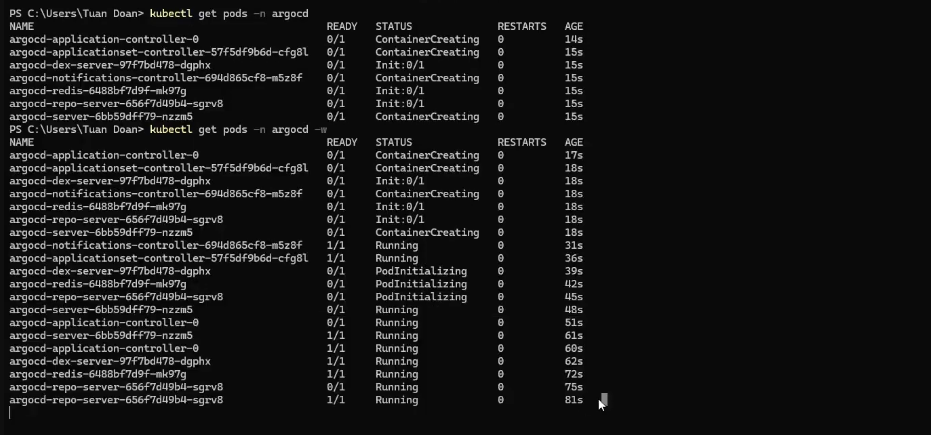
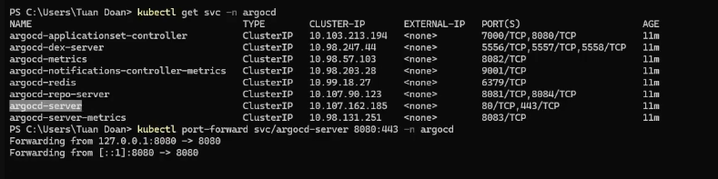

ArgoCD la gi?
    Argo CD là một công cụ phân phối liên tục dựa trên khai báo và GitOps dành cho Kubernetes.

Quick start
    kubectl create namespace argocd
    kubectl apply -n argocd --server-side --force-conflicts -f https://raw.githubusercontent.com/argoproj/argo-cd/stable/manifests/install.yaml

Setup
    kubectl get pods -n argocd --> kiem tra pods cua argocd

cach tro vao pods mong muon
    kubectl get svc -n argocd
    kubectl port-forward svc/argocd-server 8080:443 -n argocd

Truy cap local host 8080 login
    username: admin
    password: --> kubectl get secret argocd-initial-admin-secret -n argocd --> vao base64 de decode
Chay
    kubectl apply -f "path-file yaml"