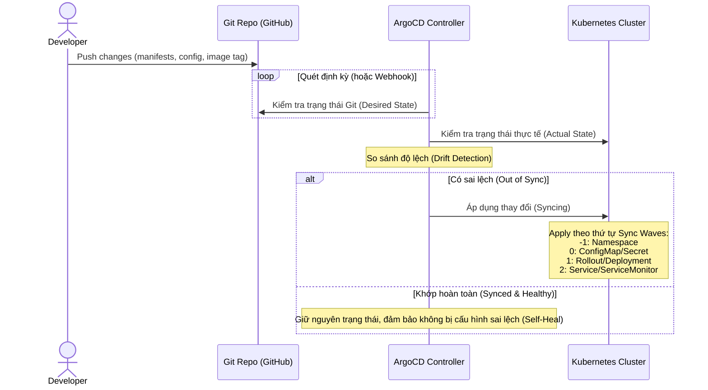
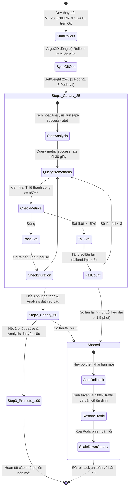
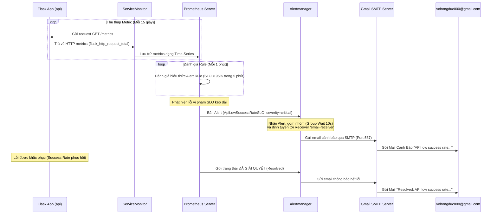

# 🔄 Luồng Hoạt Động Của Dự Án (Project Workflows & Flows)

Tài liệu này mô tả chi tiết các luồng vận hành chính trong dự án **GitOps, Observability & Progressive Delivery (Canary)**. Hệ thống được thiết kế để tự động hóa hoàn toàn từ khâu đồng bộ hạ tầng, phát hành ứng dụng an toàn cho đến giám sát chất lượng và cảnh báo sự cố.

---

## 1. Tổng Quan Luồng Hoạt Động (High-Level Architecture)

Dự án là một hệ sinh thái khép kín gồm 3 luồng hoạt động tương tác chặt chẽ với nhau:

```mermaid
graph TD
    subgraph GitOps_Flow [1. GitOps Sync Flow]
        A[Developer Commit & Push] -->|Git Repository| B[ArgoCD Root Application]
        B -->|App-of-Apps Pattern| C[ArgoCD Child Applications]
        C -->|Declarative Sync| D[Minikube Cluster Resources]
    end

    subgraph Progressive_Delivery [2. Canary Rollout & Auto-Abort Flow]
        D -->|New Container Image/Config| E[Argo Rollout: api]
        E -->|Split Traffic: 25%| F[Canary Pods vNext]
        E -->|Split Traffic: 75%| G[Stable Pods vCurrent]
        H[AnalysisRun] -->|Query Metrics Every 30s| I[(Prometheus Server)]
        E -->|Triggers| H
        H -->|Evaluation: Success Rate >= 95%| J{Metric OK?}
        J -->|Yes: Over 3m/1m| K[Promote to 100%]
        J -->|No: Fail 3 times| L[Abort & Auto-Rollback to Stable]
    end

    subgraph Observability_Alerting [3. Observability & Email Alerting Flow]
        M[Load Generator / Traffic] -->|HTTP Requests| N[API Services]
        N -->|Generate Telemetry| O[prometheus_flask_exporter]
        O -->|Metrics Endpoint: /metrics| P[ServiceMonitor]
        P -->|Scrape every 15s| I
        I -->|Evaluate PrometheusRule| Q{SLO Violated?}
        Q -->|Yes: Success Rate < 95% in 5m| R[Alertmanager]
        R -->|SMTP Gmail| S[vohongduc000@gmail.com]
    end
    
    style GitOps_Flow fill:#e3f2fd,stroke:#1e88e5,stroke-width:2px;
    style Progressive_Delivery fill:#e8f5e9,stroke:#43a047,stroke-width:2px;
    style Observability_Alerting fill:#fff3e0,stroke:#fb8c00,stroke-width:2px;
```

---

## 2. Chi Tiết Luồng 1: GitOps & App-of-Apps Sync Flow

Luồng này quản lý việc đồng bộ hóa tài nguyên K8s từ mã nguồn Git xuống Cluster Minikube thông qua **ArgoCD**.

### Sơ đồ luồng:


### Các bước hoạt động chi tiết:
1. **Root Application Khởi Chạy:** Khi chạy lệnh `kubectl apply -f argocd/root.yaml`, ArgoCD tạo ứng dụng Root. Ứng dụng này trỏ đến thư mục `cloud/w9/lab/gitops/k8s/argocd/apps`.
2. **Quản Lý Ứng Dụng Con (App-of-Apps):** ArgoCD quét thư mục `apps/` và tạo 4 ứng dụng con tương ứng:
   * **`argo-rollouts`**: Cài đặt Controller quản lý Canary.
   * **`kube-prometheus-stack`**: Cài đặt Prometheus, Grafana, Alertmanager.
   * **`web`**: Triển khai frontend application.
   * **`api`**: Triển khai backend application dạng Rollout.
3. **Kiểm Soát Thứ Tự Bằng Sync Waves:** 
   * Đầu tiên, [namespace.yaml](file:///e:/Work/Developer/AWS/XBrain_devop_cloud/ThucHanh/vohongduc-aws-accelerator-p2/cloud/w9/lab/gitops/k8s/namespace.yaml) (`wave: "-1"`) được tạo.
   * Tiếp theo là ConfigMap/Secret (`wave: "0"`).
   * Sau đó Deployments/Rollouts (`wave: "1"`) bắt đầu khởi chạy.
   * Cuối cùng, Services/ServiceMonitors (`wave: "2"`) được apply để tiếp nhận traffic và bắt đầu scrape metric.

---

## 3. Chi Tiết Luồng 2: Progressive Delivery (Canary Rollout)

Luồng này kiểm soát cách thức phiên bản mới của ứng dụng `api` được đưa ra môi trường sản xuất mà không gây gián đoạn dịch vụ đột ngột.

### Sơ đồ luồng:


### Các bước hoạt động chi tiết:
1. **Trigger Rollout:** Lớp cấu hình `api` thay đổi (Ví dụ: `VERSION: "v5"` và `ERROR_RATE: "1"`). ArgoCD đồng bộ cấu hình này xuống K8s.
2. **Khởi Chạy Canary Step 1 (25% Trọng Số):**
   * Argo Rollouts scale up 1 Pod chạy phiên bản mới (`v5`) và giữ lại 3 Pods phiên bản cũ (`v1`).
   * Phân chia traffic: 25% traffic chuyển tới Pod mới, 75% giữ ở Pods cũ.
3. **Phân Tích Metric Thời Gian Thực (AnalysisRun):**
   * Ngay khi Step 1 bắt đầu, một `AnalysisRun` được sinh ra từ `AnalysisTemplate` [analysis.yaml](file:///e:/Work/Developer/AWS/XBrain_devop_cloud/ThucHanh/vohongduc-aws-accelerator-p2/cloud/w9/lab/gitops/k8s/k8s-api/analysis.yaml).
   * Cứ mỗi **30 giây**, AnalysisRun gửi một query PromQL tới Prometheus Server để đo tỉ lệ request thành công trong **2 phút** gần nhất của service `api`.
4. **Quyết Định Hướng Đi (Promote hoặc Abort):**
   * **Trường hợp lý tưởng (Success Rate >= 95%):** Sau 3 phút pause an toàn ở mức 25%, hệ thống tự động tăng trọng số lên 50% (Step 2). Chờ tiếp 1 phút, nếu metric vẫn tốt, hệ thống chuyển hoàn toàn 100% traffic sang phiên bản mới và tắt các Pods bản cũ.
   * **Trường hợp lỗi (Ví dụ lỗi 100% khi deploy `v5` với `ERROR_RATE: "1"`):**
     * Query Prometheus trả về kết quả tỉ lệ thành công < 95% (thực tế là 0% cho traffic đi vào Pod mới).
     * AnalysisRun ghi nhận 1 lần thất bại.
     * Khi số lần thất bại liên tiếp đạt **3 lần** (tương đương khoảng 1.5 - 2 phút liên tục bị lỗi), Argo Rollouts tự động chuyển trạng thái sang `Aborted`.
     * Quá trình cập nhật bị hủy bỏ lập tức. Toàn bộ traffic lập tức được định tuyến lại về 3 Pods phiên bản cũ (`v1`). Bản mới bị tắt.

---

## 4. Chi Tiết Luồng 3: Observability & Cảnh Báo SLO Qua Email

Luồng này chịu trách nhiệm giám sát sức khỏe lâu dài của hệ thống và lập tức thông báo cho quản trị viên khi dịch vụ vi phạm các cam kết chất lượng (SLO).

### Sơ đồ luồng:


### Các bước hoạt động chi tiết:
1. **Thu Thập Số Liệu (Scraping):** Ứng dụng Flask tích hợp `prometheus_flask_exporter` tự động xuất metrics tại endpoint `/metrics`. [servicemonitor.yaml](file:///e:/Work/Developer/AWS/XBrain_devop_cloud/ThucHanh/vohongduc-aws-accelerator-p2/cloud/w9/lab/gitops/k8s/k8s-api/servicemonitor.yaml) khai báo cho Prometheus Operator biết để scrape metric này định kỳ mỗi **15 giây**.
2. **Đo Lường Cam Kết Chất Lượng (SLO Evaluation):**
   * Trong Prometheus, một PrometheusRule tên là `api-slo-alerts` liên tục chạy biểu thức PromQL để tính tỉ lệ thành công trên cửa sổ trượt 5 phút.
   * SLO được định nghĩa: **Tỉ lệ thành công của API phải >= 95%**.
3. **Bắn Cảnh Báo (Alerting):**
   * Khi tỉ lệ thành công rớt dưới 95% (ví dụ do Canary bị lỗi trước khi kịp rollback, hoặc do tải hệ thống quá cao gây lỗi 5xx), rule `ApiLowSuccessRateSLO` chuyển từ trạng thái `Pending` sang `Firing`.
   * Prometheus gửi thông báo cảnh báo sang Alertmanager.
4. **Xử Lý Và Gửi Mail (Notification Routing):**
   * Alertmanager nhận cảnh báo. Dựa trên cấu hình định tuyến trong [alertmanager-local.yaml](file:///e:/Work/Developer/AWS/XBrain_devop_cloud/ThucHanh/vohongduc-aws-accelerator-p2/cloud/w9/lab/gitops/k8s/alertmanager-local.yaml) (được nạp vào cấu hình Helm của `kube-prometheus-stack`), cảnh báo này khớp với matcher `alertname = ApiLowSuccessRateSLO`.
   * Alertmanager kết nối tới SMTP Server của Gmail (`smtp.gmail.com:587`) bằng tài khoản và mật khẩu ứng dụng đã được thiết lập qua [apply_env.py](file:///e:/Work/Developer/AWS/XBrain_devop_cloud/ThucHanh/vohongduc-aws-accelerator-p2/cloud/w9/lab/gitops/k8s/apply_env.py).
   * Email cảnh báo chi tiết được gửi trực tiếp tới hòm thư `vohongduc000@gmail.com`.
   * Khi lỗi biến mất (hệ thống phục hồi), Alertmanager sẽ gửi tiếp một email báo trạng thái **Resolved** để quản trị viên nắm được tình hình.
