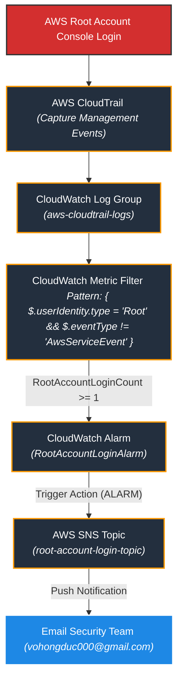
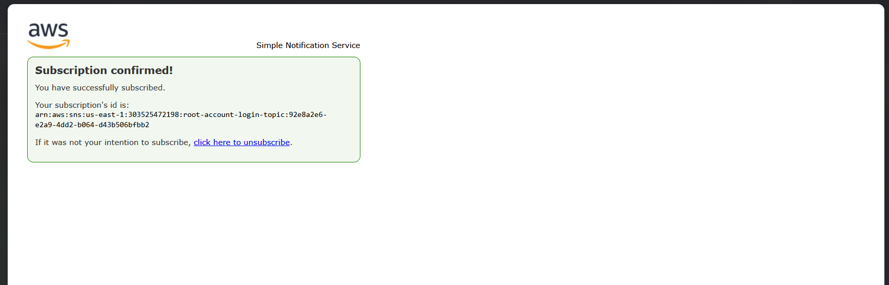
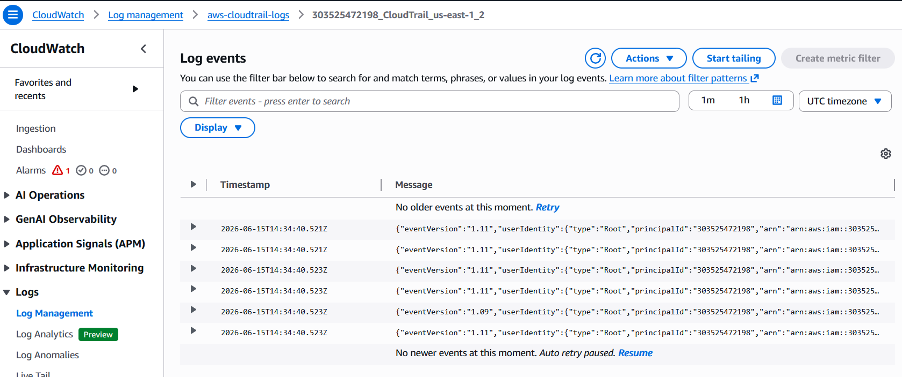
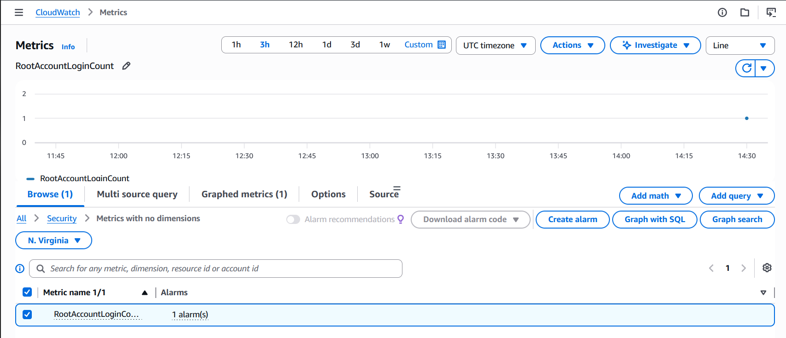
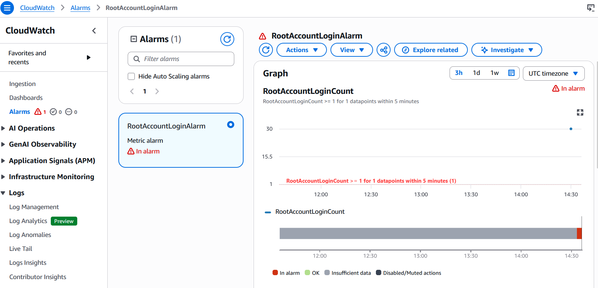
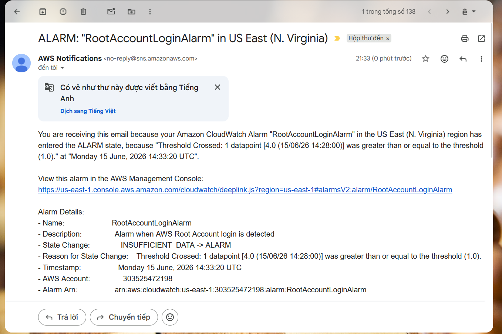

# Hướng Dẫn Thực Hành: Cảnh Báo Đăng Nhập AWS Root Account và Gửi Email qua SNS

Tài liệu này hướng dẫn chi tiết cách thiết lập hệ thống giám sát tự động bằng **Terraform** để gửi cảnh báo qua Email (thông qua **AWS SNS**) ngay lập tức khi phát hiện có hoạt động đăng nhập vào tài khoản gốc (**AWS Root Account**). Đây là một trong những thực hành bảo mật quan trọng nhất (Security Best Practice) trên AWS.

---

## ⚡ Kiến Trúc Hệ Thống



---

## ⚙️ Các Tài Nguyên Được Tạo Tự Động
1. **Dynamic Configuration:** Tự động đọc và trích xuất địa chỉ email nhận tin cảnh báo từ file [alertmanager.env](file:///e:/Work/Developer/AWS/XBrain_devop_cloud/ThucHanh/vohongduc-aws-accelerator-p2/cloud/w9/lab/gitops/k8s/alertmanager.env).
2. **S3 Bucket for CloudTrail:** Tạo một S3 bucket độc lập với bucket policy bảo mật chặt chẽ để lưu trữ log file gốc của AWS CloudTrail.
3. **CloudWatch Log Group:** Tạo Log Group `aws-cloudtrail-logs` làm đích đến của logs.
4. **IAM Role & Policy:** Cho phép CloudTrail có quyền tạo stream và ghi log (PutLogEvents) vào CloudWatch Log Group.
5. **AWS CloudTrail Trail:** Cấu hình thu thập logs của toàn bộ các vùng (multi-region trail) và gửi real-time logs sang CloudWatch.
6. **CloudWatch Metric Filter:** Quét log stream và đếm số lần đăng nhập của Root Account dựa trên Pattern:
   - Pattern: `{ $.userIdentity.type = "Root" && $.eventType != "AwsServiceEvent" }`
   - Metric Name: `RootAccountLoginCount` | Namespace: `Security` | Value: `1`
7. **CloudWatch Alarm:** Giám sát metric `RootAccountLoginCount`:
   - Ngưỡng cảnh báo: `>= 1`
   - Chu kỳ (Period): `5 phút`
   - Đánh giá (Evaluation Periods): `1 trong 1 datapoint` (cảnh báo ngay lập tức nếu có bất kỳ đăng nhập nào)
8. **SNS Topic & Subscription:** Tạo SNS Topic `root-account-login-topic` và đăng ký Email Subscription để gửi thông báo.

---

## 🚀 Hướng Dẫn Triển Khai & Chạy Thử nghiệm

### Bước 1: Khởi tạo và Áp dụng Terraform

Di chuyển vào thư mục dự án và chạy các lệnh Terraform:
```powershell
# 1. Di chuyển vào thư mục alert-root-account
cd cloud/w9/lab/alert-root-account

# 2. Khởi tạo (Sử dụng plugin cache từ các lab trước để tránh lỗi mạng)
terraform init -plugin-dir=.terraform/providers

# 3. Xem trước kế hoạch triển khai
terraform plan

# 4. Triển khai tài nguyên lên AWS
terraform apply -auto-approve
```

> [!IMPORTANT]
> **Xác nhận Email Đăng Ký (SNS Confirmation):**
> Ngay sau khi `terraform apply` thành công, AWS sẽ gửi một email xác nhận tới địa chỉ email của bạn (lấy từ `alertmanager.env`).
> Bạn **bắt buộc** phải mở hòm thư và nhấn **Confirm Subscription** thì mới có thể nhận được các cảnh báo tiếp theo.

---

### Bước 2: Thử nghiệm đăng nhập Root Account

1. Đăng xuất tài khoản AWS hiện tại trên trình duyệt.
2. Truy cập [AWS Management Console](https://console.aws.amazon.com/).
3. Chọn đăng nhập dưới quyền **Root User** (Tài khoản email chính lập tài khoản AWS).
4. Nhập mật khẩu và mã OTP/MFA để hoàn thành đăng nhập.
5. Thực hiện một vài thao tác cơ bản trên Console (ví dụ: truy cập dịch vụ EC2, S3...) để ghi nhận sự kiện hoạt động của tài khoản Root.

---

### Bước 3: Kiểm tra Trạng thái Alarm & Email Cảnh Báo

1. Quay lại AWS Console bằng tài khoản IAM User/Admin thông thường.
2. Truy cập **AWS CloudWatch** -> **Log groups** -> Tìm `aws-cloudtrail-logs` để kiểm tra log đăng nhập.
3. Truy cập **AWS CloudWatch** -> **Alarms** -> **All alarms**.
4. Tìm kiếm Alarm có tên `RootAccountLoginAlarm`.
5. Khi phát hiện sự kiện Root đăng nhập, trạng thái của Alarm sẽ chuyển sang **In alarm** (Màu đỏ).
6. Kiểm tra hòm thư email của bạn để xác nhận đã nhận được email cảnh báo chi tiết từ AWS SNS.

---

## 🧹 Dọn Dẹp Tài Nguyên

Để tránh phát sinh chi phí không mong muốn sau khi thực hành xong, hãy huỷ toàn bộ hạ tầng đã tạo:
```powershell
terraform destroy -auto-approve
```

---

## 📸 Minh Chứng Thực Hành (Evidence)

*Dưới đây là các hình ảnh kết quả thực hành đã được lưu lại:*

### 1. Trạng thái Xác nhận SNS Subscription thành công
*(Mô tả: Hình ảnh trang web hiển thị "Subscription confirmed!" sau khi click liên kết xác nhận từ Email)*


### 2. CloudWatch Log Group nhận được Log đăng nhập của Root User
*(Mô tả: Chi tiết sự kiện Console Login với userIdentity type là Root)*


### 3. Metric Filter và Biểu đồ Đăng nhập Root
*(Mô tả: Bộ lọc đếm số lần Root login trong 5 phút)*


### 4. CloudWatch Alarm chuyển sang trạng thái ALARM (In alarm)
*(Mô tả: Trạng thái Alarm chuyển đỏ khi phát hiện đăng nhập)*


### 5. Email Alert nhận từ AWS SNS thông báo Root Login
*(Mô tả: Nội dung Email cảnh báo Root login được gửi tới tài khoản bảo mật)*

