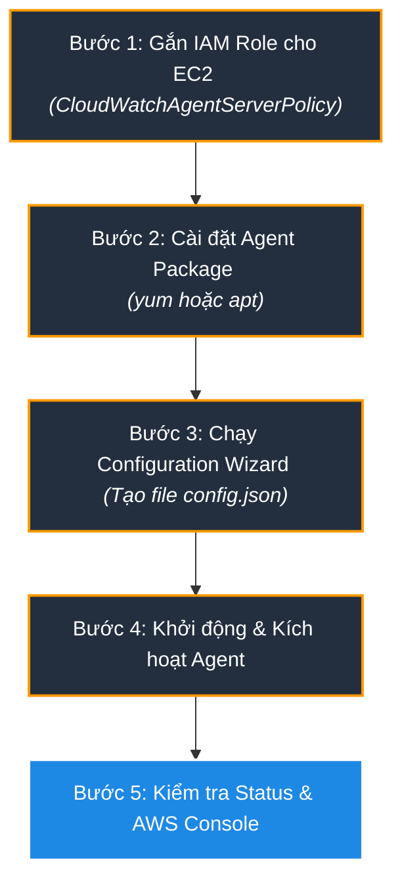
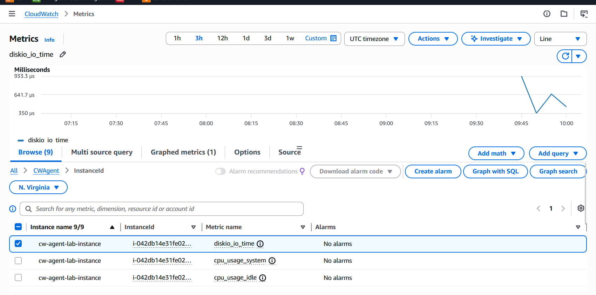
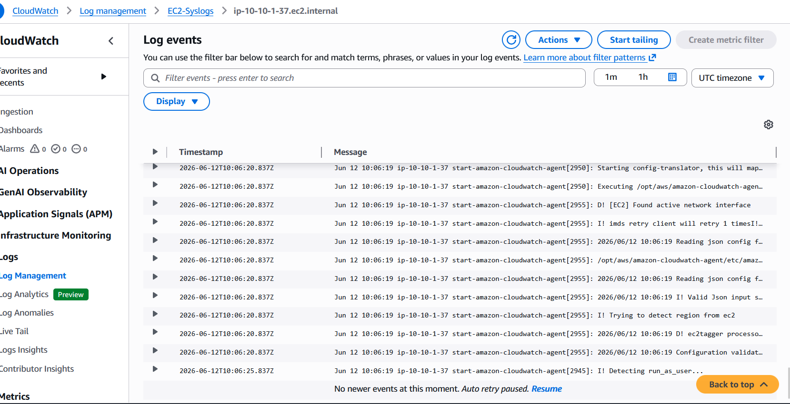

# Hướng Dẫn Thực Hành: Cấu hình CloudWatch Agent trên EC2

Tài liệu này hướng dẫn chi tiết từng bước để cài đặt, cấu hình và kiểm tra hoạt động của **Amazon CloudWatch Agent** trên một instance EC2 để thu thập các metrics nâng cao (RAM, Disk...) và Logs hệ thống gửi về AWS CloudWatch.

---

## ⚡ Hướng Dẫn Nhanh: Triển Khai 1-Click bằng Terraform

Nếu bạn muốn tạo nhanh một EC2 instance hoàn chỉnh đã tự động cấu hình sẵn IAM Role (`CloudWatchAgentServerPolicy`) và cài đặt/khởi chạy sẵn CloudWatch Agent thu thập RAM, Disk, Syslog, bạn chỉ cần sử dụng file [main.tf](file:///e:/Work/Developer/AWS/XBrain_devop_cloud/ThucHanh/vohongduc-aws-accelerator-p2/cloud/w9/lab/cloudwatchagent/main.tf) đi kèm trong thư mục này.

### Các bước chạy nhanh:
```powershell
# 1. Di chuyển vào thư mục lab
cd cloud/w9/lab/cloudwatchagent

# 2. Khởi tạo terraform
terraform init

# 3. Apply để tự động tạo hạ tầng và setup Agent
terraform apply -auto-approve
```

Sau khi Apply hoàn tất, bạn sẽ nhận được thông tin đầu ra chứa **Public IP** và **lệnh SSH nhanh**. Bạn có thể SSH vào kiểm tra hoặc lên thẳng AWS CloudWatch Console để xem dữ liệu được đẩy về!

Để dọn dẹp tài nguyên sau khi học xong nhằm tránh phát sinh chi phí:
```powershell
terraform destroy -auto-approve
```

---


## 🛠️ Quy Trình Triển Khai (4 Bước Chính)



---

## 📋 Hướng Dẫn Chi Tiết Từng Bước

### Bước 1: Chuẩn bị IAM Role cho EC2 Instance (Prerequisite)

Để EC2 Instance có quyền đẩy dữ liệu Metrics và Logs về CloudWatch, bạn cần gắn IAM Role phù hợp cho nó.

1. Truy cập **AWS Console** -> **IAM** -> **Roles**.
2. Nhấp chọn **Create role**:
   - **Trusted entity type**: AWS service.
   - **Use case**: EC2.
3. Tại bước gán Policy, tìm kiếm và tích chọn chính xác policy:
   - **`CloudWatchAgentServerPolicy`** (Policy quản lý bởi AWS cấp quyền ghi dữ liệu vào CloudWatch và đọc cấu hình từ SSM Parameter Store nếu cần).
4. Đặt tên Role (ví dụ: `EC2-CloudWatchAgent-Role`) và hoàn tất tạo.
5. Quay lại danh sách **EC2 Instances**, chọn instance của bạn -> **Actions** -> **Security** -> **Modify IAM role**.
6. Chọn Role vừa tạo và bấm **Update IAM role**.

---

### Bước 2: Cài đặt gói CloudWatch Agent (Install the Agent Package)

Kết nối SSH vào EC2 instance của bạn và chạy lệnh cài đặt tương ứng với hệ điều hành:

#### 🔹 Đối với Amazon Linux 2 / Amazon Linux 2023 / RHEL:
```bash
sudo yum update -y
sudo yum install amazon-cloudwatch-agent -y
```

#### 🔹 Đối với Ubuntu / Debian:
```bash
sudo apt-get update -y
sudo apt-get install wget -y
wget https://s3.amazonaws.com/amazoncloudwatch-agent/ubuntu/amd64/latest/amazon-cloudwatch-agent.deb
sudo dpkg -i -E ./amazon-cloudwatch-agent.deb
```

---

### Bước 3: Chạy trình cấu hình tự động (Run Configuration Wizard)

CloudWatch Agent sử dụng một file JSON cấu hình để biết cần giám sát các thông số và file log nào. AWS cung cấp một Wizard tương tác giúp bạn sinh file cấu hình này dễ dàng.

Chạy lệnh sau:
```bash
sudo /opt/aws/amazon-cloudwatch-agent/bin/amazon-cloudwatch-agent-config-wizard
```

#### ✍️ Các lựa chọn cấu hình khuyến nghị khi chạy Wizard:
*   **Operating System**: `1` (Linux)
*   **Platform**: `1` (EC2)
*   **User to run the agent**: `1` (root)
*   **Do you want to turn on StatsD daemon?**: `2` (No - trừ khi bạn cần gom metrics từ app dạng StatsD)
*   **Do you want to turn on CollectD daemon?**: `2` (No)
*   **Do you want to monitor any host metrics?**: `1` (Yes)
*   **Do you want to monitor CPU metrics?**: `1` (Yes)
*   **Do you want to monitor CPU metrics per core?**: `2` (No - để tiết kiệm dung lượng lưu trữ)
*   **Do you want to monitor ec2 dimensions?**: `1` (Yes)
*   **Do you want to aggregate ec2 dimensions?**: `1` (Yes)
*   **Would you like to collect your metrics at high resolution?**: `4` (60s - Chu kỳ thu thập tiêu chuẩn)
*   **Which default metrics config do you want?**: `2` (Standard - Giám sát tốt RAM, Disk, CPU)
*   **Are you satisfied with the above config?**: `1` (Yes)
*   **Do you have any existing CloudWatch Log Agent configuration file to import?**: `2` (No)
*   **Do you want to monitor any log files?**: `1` (Yes) (Nếu muốn thu thập Logs từ EC2)
    *   *Log file path:* `/var/log/messages` (Amazon Linux) hoặc `/var/log/syslog` (Ubuntu)
    *   *Log group name:* `EC2-System-Logs` (Tên nhóm log sẽ hiển thị trên CloudWatch)
    *   *Log stream name:* `{hostname}`
*   **Do you want to store the config in the SSM Parameter Store?**: `2` (No - lưu local tại EC2 để đơn giản. Chọn `Yes` nếu muốn đồng bộ cấu hình cho nhiều EC2).

> [!NOTE]
> File cấu hình sau khi tạo xong qua Wizard sẽ được lưu tại: `/opt/aws/amazon-cloudwatch-agent/bin/config.json`. Bạn có thể chỉnh sửa thủ công file này bất cứ lúc nào để thêm bớt metrics hoặc log paths.

---

### Bước 4: Khởi động và Kích hoạt CloudWatch Agent

Để áp dụng file cấu hình vừa tạo và khởi động Agent, hãy chạy lệnh sau:

```bash
# Áp dụng cấu hình và khởi động Agent
sudo /opt/aws/amazon-cloudwatch-agent/bin/amazon-cloudwatch-agent-ctl \
  -a fetch-config \
  -m ec2 \
  -s \
  -c file:/opt/aws/amazon-cloudwatch-agent/bin/config.json
```

**Tham số giải thích:**
- `-a fetch-config`: Yêu cầu agent nạp cấu hình mới.
- `-m ec2`: Định nghĩa môi trường chạy là EC2.
- `-s`: Khởi động (start) dịch vụ sau khi nạp cấu hình.
- `-c file:...`: Chỉ định đường dẫn file cấu hình cục bộ.

Kích hoạt dịch vụ tự khởi động cùng hệ thống:
```bash
sudo systemctl enable amazon-cloudwatch-agent
```

#### ⚠️ Lưu ý quan trọng cho Ubuntu/Debian:
Trên hệ điều hành Ubuntu, tệp tin log hệ thống `/var/log/syslog` mặc định thuộc nhóm sở hữu **`adm`**. CloudWatch Agent (chạy dưới user `cwagent`) sẽ **bị lỗi Permission Denied** và không thể đẩy log về AWS nếu không nằm trong nhóm này. 

Hãy chạy thêm lệnh sau để cấp quyền đọc syslog cho Agent:
```bash
# 1. Thêm user cwagent vào nhóm adm
sudo usermod -aG adm cwagent

# 2. Restart lại Agent để cập nhật quyền
sudo systemctl restart amazon-cloudwatch-agent
```

---

### Bước 5: Kiểm tra & Xác minh trạng thái (Verify & Check Status)

#### 1. Kiểm tra trạng thái Agent trên EC2:
```bash
sudo /opt/aws/amazon-cloudwatch-agent/bin/amazon-cloudwatch-agent-ctl -m ec2 -a status
```

**Kết quả kỳ vọng (Trạng thái running):**
```json
{
  "status": "running",
  "starttime": "2026-06-12T08:52:12Z",
  "configstatus": "configured",
  "version": "1.300026.0b357"
}
```

#### 2. Xác minh trên AWS CloudWatch Console:
*   **Kiểm tra Custom Metrics (RAM/Disk):**
    - Truy cập **CloudWatch** -> **Metrics** -> **All metrics**.
    - Tìm namespace **`CWAgent`**.
    - Bạn sẽ nhìn thấy các chỉ số nâng cao như `mem_used_percent` (Tỉ lệ RAM sử dụng) và `disk_used_percent` (Tỉ lệ dung lượng đĩa sử dụng) của instance EC2.
    
    

*   **Kiểm tra Logs hệ thống:**
    - Truy cập **CloudWatch** -> **Logs** -> **Log groups**.
    - Chọn log group bạn đã cấu hình ở Bước 3 (ví dụ: `EC2-Syslogs`).
    - Kiểm tra luồng log (Log stream) khớp với hostname của EC2 để xem các dòng log hệ thống được cập nhật theo thời gian thực.

    