# Hướng Dẫn Thực Hành: Cảnh Báo CPU EC2 và Gửi Email qua SNS

Tài liệu này hướng dẫn chi tiết cách triển khai hệ thống giám sát tự động bằng **Terraform** để gửi cảnh báo qua Email (thông qua **AWS SNS**) khi hiệu năng sử dụng CPU của EC2 instance vượt quá **80% trong 5 phút liên tục**.

---

## ⚡ Kiến Trúc Hệ Thống

```mermaid
graph LR
    EC2["EC2 Instance <br><i>(Stress-testing)</i>"] -- "CPUUtilization > 80%" --> CW["CloudWatch Alarm <br><i>(Period: 5m, Eval: 1/1)</i>"]
    CW -- "Trigger Action (ALARM/OK)" --> SNS["AWS SNS Topic <br><i>(ec2-cpu-alarm-topic)</i>"]
    SNS -- "Push Notification" --> Email["Email Subscriber <br><i>(vohongduc000@gmail.com)</i>"]

    style EC2 fill:#232F3E,stroke:#FF9900,stroke-width:2px,color:#fff
    style CW fill:#232F3E,stroke:#FF9900,stroke-width:2px,color:#fff
    style SNS fill:#232F3E,stroke:#FF9900,stroke-width:2px,color:#fff
    style Email fill:#1E88E5,stroke:#fff,stroke-width:2px,color:#fff
```



---

## ⚙️ Các Tài Nguyên Được Tạo Tự Động
1. **Dynamic Configuration:** Tự động đọc và trích xuất địa chỉ email nhận tin cảnh báo từ file [alertmanager.env](file:///e:/Work/Developer/AWS/XBrain_devop_cloud/ThucHanh/vohongduc-aws-accelerator-p2/cloud/w9/lab/gitops/k8s/alertmanager.env).
2. **VPC & Networking:** Tạo VPC mới (`10.20.0.0/16`), Public Subnet, Internet Gateway và Route Table để đảm bảo môi trường Lab cô lập, an toàn.
3. **Security Group:** Cho phép truy cập SSH inbound (Port 22) từ mọi nơi và cho phép truy cập outbound đầy đủ.
4. **EC2 Instance:** Sử dụng Ubuntu 22.04 LTS, tự động tạo SSH key pair cục bộ (`email-alert-lab-key.pem`), cài đặt sẵn công cụ giả lập tải nặng `stress` và `stress-ng`.
5. **SNS Topic & Subscription:** Tạo SNS Topic và đăng ký Email Subscription nhận cảnh báo.
6. **CloudWatch Alarm:** Cấu hình cảnh báo dựa trên metric `CPUUtilization` của EC2 instance:
   - Ngưỡng cảnh báo: `> 80%`
   - Chu kỳ (Period): `5 phút` (300 giây)
   - Đánh giá (Evaluation Periods): `1 trong 1 datapoint`
   - Hành động: Gửi thông báo tới SNS Topic khi chuyển sang trạng thái **ALARM** và trạng thái **OK** (Khôi phục).

---

## 🚀 Hướng Dẫn Triển Khai & Chạy Thử nghiệm

### Bước 1: Khởi tạo và Áp dụng Terraform

Di chuyển vào thư mục dự án và chạy các lệnh Terraform:
```powershell
# 1. Di chuyển vào thư mục emailalert
cd cloud/w9/lab/emailalert

# 2. Khởi tạo (Sử dụng các provider được cache)
terraform init

# 3. Xem trước kế hoạch triển khai
terraform plan

# 4. Triển khai tài nguyên lên AWS
terraform apply -auto-approve
```

> [!IMPORTANT]
> **Xác nhận Email Đăng Ký (SNS Confirmation):**
> Ngay sau khi `terraform apply` thành công, AWS sẽ gửi một email xác nhận tới địa chỉ email của bạn (lấy từ `alertmanager.env`). 
> Bạn **bắt buộc** phải mở hòm thư và nhấn **Confirm Subscription** thì mới có thể nhận được các cảnh báo tiếp theo.

---

### Bước 2: SSH vào EC2 và Giả lập CPU > 80%

1. Sử dụng lệnh SSH được in ra ở phần Output của Terraform (ví dụ):
   ```powershell
   ssh -i email-alert-lab-key.pem ubuntu@<IP_PUBLIC_CỦA_BẠN>
   ```
2. Chạy công cụ giả lập stress CPU hoạt động ở mức 100% trong 400 giây:
   ```bash
   stress --cpu 2 --timeout 400s
   ```
3. Bạn có thể mở một terminal SSH thứ hai và chạy lệnh `htop` hoặc `top` để xác minh CPU đã chạy hết công suất.

---

### Bước 3: Kiểm tra Trạng thái Alarm & Email Cảnh Báo

1. Truy cập **AWS Console** -> **CloudWatch** -> **Alarms** -> **All alarms**.
2. Tìm kiếm Alarm có tên `ec2-high-cpu-alarm`.
3. Sau 5 phút liên tục CPU vượt quá 80%, trạng thái của Alarm sẽ đổi từ `OK` sang `In alarm`.
4. Kiểm tra hòm thư email của bạn để xác nhận đã nhận được email cảnh báo chi tiết từ AWS.
5. Sau khi lệnh `stress` kết thúc, tải CPU giảm xuống dưới 80%. Sau 5 phút, Alarm sẽ đổi trạng thái từ `In alarm` về `OK` và bạn sẽ nhận được một email thông báo khôi phục (Recovery notification).

---

## 🧹 Dọn Dẹp Tài Nguyên

Để tránh phát sinh chi phí không mong muốn sau khi thực hành xong, hãy huỷ toàn bộ hạ tầng đã tạo:
```powershell
terraform destroy -auto-approve
```

---

## 📸 Minh Chứng Thực Hành (Evidence)

*Dưới đây là các hình ảnh kết quả thực hành đã được lưu lại:*

### 1. Trạng thái Xác nhận SNS Subscription thành công
*(Mô tả: Hình ảnh trang web hiển thị "Subscription confirmed!" sau khi click liên kết xác nhận từ Email)*
<!-- Thay thế link ảnh bên dưới bằng ảnh thật của bạn -->
``

### 2. CloudWatch Alarm chuyển sang trạng thái ALARM (In alarm)
*(Mô tả: Biểu đồ giám sát CPU vượt ngưỡng 80% và trạng thái Alarm hiển thị màu đỏ)*
<!-- Thay thế link ảnh bên dưới bằng ảnh thật của bạn -->
``

### 3. Email Alert nhận từ AWS SNS
*(Mô tả: Nội dung Email cảnh báo CPU vượt quá ngưỡng gửi từ AWS)*
<!-- Thay thế link ảnh bên dưới bằng ảnh thật của bạn -->
``

### 4. CloudWatch Alarm khôi phục về trạng thái OK
*(Mô tả: Biểu đồ CPU giảm và trạng thái Alarm đổi sang màu xanh lá)*
<!-- Thay thế link ảnh bên dưới bằng ảnh thật của bạn -->
``

### 5. Email thông báo Recovery (OK) nhận từ AWS SNS
*(Mô tả: Nội dung Email khôi phục khi CPU trở lại bình thường)*
<!-- Thay thế link ảnh bên dưới bằng ảnh thật của bạn -->
``
